# Node Runner design system

Android + Godot 4 teaching app about neuroevolution. This export has the project rules, the tokens, every component with its screenshot and its documentation, and the component library reference.

**Contents:** `README.md` (this file, everything in one place), `tokens.json`, `bundle.css`, `library.md` (the `c_*` controls), `components/<Name>/` (README.md and a self-contained preview.html per component) and `screenshots/<Name>.png`.

**Contents of this file:** the project rules, then the index, then each component with screenshot and documentation.

# Project rules

Node Runner teaches what a neural network is by letting the player build a small creature and watch it learn to walk. The thing being sold is the understanding, not the creature: every screen must answer "why did it do that?". A control that neither teaches something nor drives the core loop does not belong.

The feeling is a **neon lab bench**, not a cute toy: a dark arena, glowing parts, high-contrast readouts. The audience is a curious beginner who has heard of machine learning but never touched it. Android phone, landscape only, touch only: no keyboard, no hover, no right-click.

## How the app is organised

The app is hub and spoke around the **Creations** menu (see Navigation). **Build** and **BuildLocked** are one scene (`Build`, with a `locked` flag) in two states. **Unlocked (Build):** draw as many beams as you like, place limited parts from a **Parts tray** (Links, On a joint, Sensors, Blocks), tap any part to edit its settings, and choose the brain's shape in **Brain setup** in the overflow menu. Everything **autosaves** and the primary action is **Start training**. **Locked (BuildLocked):** after a training session has finished the parts and the brain's shape are locked, so the machine-learning model can never be broken. You can still move things, open **Stats**, tap the **brain widget** to see which senses drive which outputs, and press **play** to train more (**Train setup**, then **Training**). The **padlock** unlocks it again, which resets the training after a warning. **Achievements** unlock new parts and maps. **Settings** (UI size, theme, sounds) opens from the Creations overflow menu. A card on Creations can be **copied** (identical, brain intact) or **deleted**.

## Canvas and layout

All spacing is `space-1` to `space-5` and all control heights are `control-xs`, `control-sm`, `control` or `touch` (see Spacing). No other pixel value is used for layout.

Design on a 640 x 360 (16:9) reference and lay it out so it also fits wider screens: the height is fixed at 360 units and the width is whatever the device has (640 at 16:9, about 800 at 20:9). The top bar, tool rail and side panel keep their sizes; **the arena or canvas takes all the width that is left**, so extra width becomes play area, never wider panels or bigger controls. **UI size** (Settings) multiplies the whole scale, so the screen holds fewer units: 200% leaves 320 x 180 on a 16:9 device. Nothing shrinks below its size; when the arena would get narrower than 200 units the side panel collapses to its 28px tab (see Build). Inset for the display cutout and gesture bar. Every top bar is 48px with the same shape: Back, title, spacer, at most two icons and an overflow. Below it an arena or canvas on the left and one fixed side panel (168 to 176px) on the right; Build and BuildLocked have a 56px tool rail on the left. Touch targets are at least `touch` (48px). Keep 8px (`space-2`) from screen edges.

## Keep it quiet

A phone in landscape has about 360px of height, so each screen shows only what the player needs right now.

- At rest a screen shows one picture per idea and at most one sentence of text. Captions, legends and counts appear only on tap, or when something is wrong.
- One focus at a time: one expanded card, one halo, one hint. Tapping something new collapses the old.
- Text has three levels only: a title (`heading`), one line of `body`, and short labels. No paragraph is shown unprompted; a first-time hint is one line and appears once.
- Numbers you must have (distance, generations) get `readout`; everything else is a shape with a name on tap.
- Prefer a bar, dial or hatch to a number, and a dashed or filled shape to a colour legend.
- Settings and rare actions (Brain setup, Restore example, Delete) live in the overflow menu, not on the screen.

## Selecting a part

The rail is **Move** (also tap to select one part; it never adds joints), **Beam** (joins two joints), **Joint** (adds one) and **Select** (several at once, with move, rotate and scale handles around the selection). Tapping a part or beam opens its **settings** (see PartSettings). They take the place of the Parts tray when unlocked and sit under the brain widget when locked. A motor has a **Fixed part** and a **Target part**, both lit on the canvas and both chosen from the beams that touch the joint. Settings that change the model (beam length) are locked once the creation is locked.

## The words

Use exactly these words and glyphs (see Parts). **Beam**: a rigid rod between two joints. Joints are added with the **Joint** tool, never by Move or Beam. **Node** and **Joint**: where beams meet; a joint has angle limits and is never a motor by itself. Parts you place, limited in number: on a joint, **Brake**, **Servo**, **Stepper**, **Velocity motor** and **Wheel**; sensors on a joint, the **Core** (velocity, elevation, tilt) and the **LOS sensor** (1 to 5 rays, the eyes); links between two nodes, **Spring / damper**, **Piston** and **Wing**; and the objects **Battery**, **Generator** and **Fuel tank**, which have four fixed corner joints and can be moved and rotated. A joint holds one part. The product word for a saved thing is **creation**; **shadow** is one of the ghost copies that race at once during training.

The causal chain is the sentence to serve: cores and sensors sense the world, the brain works out what to do, motors (and any other outputs) move the body, the body moves, distance is the score. The numbered stages **1 Senses, 2 Brain, 3 Outputs, 4 Distance** carry it on every screen that shows live data.

## Rules that fix the known problems

- **No dead air.** Trials run one at a time (about 10 s each, 8 per generation). The GenerationStrip makes a generation a shape and its one line says "try 5 of 8".
- **Numbers are a diagram, not a log.** Sensors and motors live in SignalFlow (bars and dials, named on tap), neurons in BrainFocus. Never a scrolling text list of raw values.
- **One reset.** Training is only lost by unlocking a creation, with a warning that names it and a hold to confirm. Delete is the same dialog and the same hold, and there is no Undo.
- **Nothing is disposable.** Creations autosave with a visible "Saved" cue, are named (editable), listed and resumable; Copy makes an identical creation with its brain.
- **The camera follows.** The creature stays about 43% from the left, the ruler scrolls, and a dashed best marker sits ahead.
- **Build gives live feedback.** Part counts ("1 left"), rigidity and one validation line update as you build; Start training is dimmed with the reason instead of failing later.
- **Trained means locked.** After the first finished session only moving is allowed; Beam is dashed and locked, the tray is gone, and a padlock in the top bar says why and offers the way out.

## Decisions already made

- **Changing a trained creation's body** means unlocking it, which resets the training; Copy it first to keep the trained one.
- **Copy** keeps the brain and training exactly.
- **Unlocked parts and maps** are player-wide, earned in Achievements, and available to every creation.

## Power

Powered parts (servo, stepper, velocity motor, LOS sensor, piston) draw from a shared supply made by generators, as much as they can, and stored in batteries; fuel tanks feed generators. When draw is more than output every powered part gets the same fraction of its force, and when everything is spent the run ends. Show it with the bolt chip on the canvas and the Power budget (see Power), never with colour alone.

## Colour, type, and never colour alone

Base is `bg`; surfaces are `panel` and `panel-raised`. There is one signal colour, `accent`, which also marks senses. `output` (yellow) marks outputs when a part is inspected. `halo` means "you tapped this", `danger` means invalid or destructive. Body text is `ink`, captions `muted`. State always pairs colour with a shape, label, position, hatch, dash or icon; dashed edges mean "pushes against", a hatched triangle means rigid, a lock means unavailable. Contrast must survive a phone in daylight: text at 4.5:1 or better, marks 3:1, in both themes.

Type: `heading` and `stage` in Chakra Petch, `body`, `label` and `caption` in Barlow, every changing number in `readout`, `readout-lg` or `readout-sm` in JetBrains Mono. These families are a proposal; bundle the files in the Godot project and swap the names in `tokens.json` to change them. Instructions and explanations are `body` (13px); helper lines under a control are `note` (11px) and `caption` (10px) is for one to three words in dense cards. Text is always one of the seventeen styles in tokens.json (see ColorsAndStyles), and icons are `icon-sm`, `icon`, `icon-lg` or `icon-xl`.

## The Tron feel

The neon theme should read as a lit grid: dark surfaces, thin bright lines, light that comes from the lines rather than fills.

- **Lit lines.** Motor arcs, cores, the firing node, the ground trail and corner brackets use `accent` at 2px with the `glow` class (a soft drop shadow in `accent-glow`). Resting beams and node outlines stay `line-strong`, so light means "live".
- **Grid floor.** The arena and the build canvas sit on a faint 24 to 32px line grid in `line`, faded toward the edges so the creature stays the brightest thing.
- **Light trail.** The ground line behind the creature is a gradient that fades in from the left and shows the distance it has run; ahead of the creature it is an unlit `line-strong` rule.
- **Edge lighting.** Frame, top bar, panels and cards are outlined with `edge` (a cyan-tinted hairline in neon, plain grey in paper) plus a faint `accent-glow` halo.
- **HUD corners and traces.** Two `accent` corner brackets top left and right of the arena and canvas, and one or two circuit traces in `edge`; never more, and never near text.
- **Removable.** All of the above use `accent-glow`, `glow` or the `.glow` class, so paper and `data-effects="lite"` turn the light off and keep the grid, lines and shapes.

## Theming and effects

Neon (`dark`) is the reference theme and the default; every screen in this system is drawn in it. Everything reads from tokens, so a theme is a set of values: `dark` (neon) and `paper` (light, no glow) ship, and the Themes card shows the same screen in each. The player chooses Neon, Paper or Use phone in Settings (Use phone follows the phone's light or dark setting). `data-effects="lite"` turns off `glow` and `accent-glow` for low-end devices; motion (signal pulses on edges, firing glow, ring timers) must also be switchable and snaps to values under reduced motion. No hardcoded colours, fonts, stroke widths or icons in core logic; keep sim state in the sim layer and let the UI observe it.

## Copy

Plain words first: "Senses", "Brain", "Outputs", "How long is each try". Teach a term once, in one sentence, where it appears (node, beam, core, motor relation). Sentence case in copy; upper case only in labels and stage names. No emoji, no exclamation marks. Name what is lost before asking for confirmation ("142 generations of training").

## Iconography

A stroked glyph set on a 24px grid, 2px stroke, round caps, `currentColor`: menu, back, more, play, pause, speed, restart, plus, copy, trash, lock, unlock, check, x, warn, move, beam, core (eye), build, flag, brain. The part glyphs (node, beam, core, motor arc) are the same drawings used in the arena.

## Not yet drawn

Empty state for a first launch, onboarding, accessibility settings beyond UI size, music, map details, and a tablet layout.

**Rule: frames.** A panel, card, tile or dialog is `c_card` (class `pnl`): radius-lg, padding space-3, 1px `edge`. It has these variants, all of the same frame: `sel` (accent border and glow), `pick` (halo ring, the chosen stage), `lock` (dashed, dimmed), `warn` (danger border), `hint` (halo border), `ok`, `glow` and `raised`; menu and dialog are the frames `menu` and `dialog`. The sizes `snug`, `tight`, `roomy` and `flush` (a thumbnail that bleeds to the edge) only change the padding. A frame does not set its own radius, padding or border colour. A tool rail is a screen layout, not a frame: `.rail` stacks `btn stack` cells touch by touch, space-1 apart.

**Rule: colour.** Every colour is a token from tokens.json, defined once per theme and referenced as `var(--name)`. A component never holds a hex or rgba value, so a theme swap or a change to a token reaches everything. Transparency comes from a token that has it (`accent-soft`, `accent-glow`, `scrim`) or from `opacity`, not from a new literal. The build fails on any literal colour.

**Rule: icons.** An icon or part glyph is one colour and has no colour of its own: it takes its parent's (`ink` by default, `muted` when quiet or locked, `accent` when selected, `danger` for destructive). UI icons are strokes on a 24 grid with a 2 px stroke, part glyphs are strokes on a 20 grid with a 1.67 stroke (the same line at the same size), both drawn in `currentColor`. Every stroke in an icon has that one width: no thin details, and a heavier line is never used to say something is important. In Godot import the SVG as white and tint with `modulate` or a Button's icon colours.

**Rule: one implementation.** Every control, frame and figure comes from the component library (`c_*` functions in the kit; in Godot, one scene each) and is marked `data-c` in the preview HTML, or is one of its classes (`btn`, `chip`, `bar`, `field`, `partrow`, `call`, `pnl`, `well`, `switch`, `scrollbar`, `rail`). A screen never draws its own copy: no hand-built frame (border, radius and background on a bare element), no inline border, radius, background or shadow on a component class, no second progress ring. A new look is a variant of the component, added once. The build lists every violation and fails on any.

**Rule: text is a class.** A view or component puts `class="t-<style>"` on its text (`t-title`, `t-body`, `t-label`, `t-readout`...) and nothing else: no inline `font`, `font-size`, `font-weight`, `font-family`, `line-height`, `letter-spacing` or `text-transform`. The class carries the font, the tracking and the case of its style, so one place decides them. In Godot each style is a `LabelSettings` or a theme type variation.

**Rule: size is content.** A view never sets `width`, `height`, `left`, `top`, `right` or `bottom` in pixels. A component is as big as its content, its font size and its padding tokens (`wrap_content` in Android, `custom_minimum_size` left at zero in Godot). Where a size has to be fixed it is named once in Spacing and used by class: screen slots (`slot-rail`, `slot-arena`, `slot-side`, `slot-tray`, `slot-fill`, `slot-foot`), page columns (`pg`), value columns and card widths (`w-col-*`, `w-card`, `w-tile`, `w-well`), menu and dialog widths (`w-menu`, `w-dialog`), and the figures that have to be exact (`w-brain`, `h-screen`, `h-stage`, `h-thumb`). The arena has no width of its own: it takes what the rail and side panel leave, so a wider screen gives it more. A callout's position in a figure is data and stays. The build fails on any other fixed size in a view.

---

# Index

## Foundations

- [ColorsAndStyles](#colorsandstyles): Colour tokens in both themes, the seventeen text styles and the icons
- [ComponentLibrary](#componentlibrary): Every control and frame the game uses: buttons, sliders, fields, panels, rows, progress
- [Navigation](#navigation): How the screens connect
- [Overlays](#overlays): The two confirmations and the achievement toast, and where each appears
- [Parts](#parts): Every part, and how each kind is placed
- [Spacing](#spacing): Space scale, control sizes and how a bar is built from them

## Components

- [GenerationStrip](#generationstrip): The shadow strip: who is ahead, and who to follow
- [SignalFlow](#signalflow): Senses, Brain, Outputs, Distance: at rest, other outputs, a core tapped, a large brain

## Screens

- [Achievements](#achievements): Achievements: where new parts and maps are earned
- [BrainFocus](#brainfocus): Brain: which senses drive which outputs. Line thickness, no numbers
- [BrainScale](#brainscale): Brain on a large network: squares, and one strong path from senses to outputs
- [BrainSetup](#brainsetup): Brain setup: hidden layers, neurons per layer, with the shared slider
- [Build](#build): Build: place parts, move and rotate blocks, autosaved, Start training
- [BuildLocked](#buildlocked): BuildLocked: a trained creation, locked. Brain widget, what drives what, padlock and play
- [Creations](#creations): Creations: the home menu. Tap a card to open, Copy, Delete
- [PartSettings](#partsettings): The settings of every part, the fixed-part picker and angle limits
- [Power](#power): Power budget, and the power chip in Build and while training
- [Settings](#settings): Settings: UI size, theme (Neon, Paper, Use phone) and sounds
- [Splash](#splash): Splash: the cover artwork on a screen while the app loads
- [Stats](#stats): Stats: distance, speed and elevation, over generations
- [TrainSetup](#trainsetup): Train setup: Train or Simulate, shadows, run length, map
- [Training](#training): Training: shadows run at once; a tapped core expands Senses
- [Wing](#wing): A beam with a lift side: gliding, flapping, flip and placement

## Themes

- [Themes](#themes): Same screen, paper theme and low-effects neon

## Other

- [Cover](#cover): 

---

# ColorsAndStyles

*Foundations · Colour tokens in both themes, the seventeen text styles and the icons*

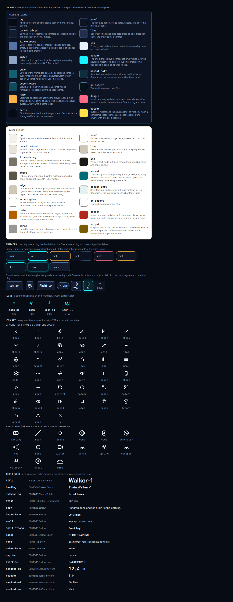

The **foundations** every component is built from: colours, text styles, radius and icons. A component or a screen never defines any of these itself; it names a token or a class. The components are on the ComponentLibrary page, and spacing and control sizes are on Spacing.

**Colours.** Sixteen tokens, each defined once per theme (Neon lab, dark, and Paper, light) and used by name (`var(--accent)`, `accent` in Godot). The page shows every token in both themes. A screen can be themed by changing the theme only.

**Surfaces.** There are two, and nothing else draws a border, a radius, a background or a shadow. **Frame** (`.pnl`, `c_card`; in Godot one `StyleBoxFlat` `frame`) holds things: `radius-lg`, `edge` 1px, `panel`, padding `space-3`. Its looks are variants of the same frame: `sel` (accent 2px and glow), `pick` (a halo ring, for the chosen stage), `lock` (dashed, dimmed), `warn` (danger border), `hint`, `ok`, `glow`, `raised`, and the sizes `snug`, `tight`, `roomy` and `flush`. Menu, dialog and stage card are frames (`menu`, `dialog`, `glow snug`), not their own. **Raised** (one `StyleBoxFlat` `raised`) is anything you press or type in: `radius-md`, `line-strong` 1px, `panel-raised`. Button (in every kind and layout), field, list row, segmented control and chip share it; their states (`on`, `lock`, `off`, `primary`, `danger`) change the border or fill and nothing else.

**Icon set.** Every UI icon (39) and part glyph (15) is shown by name on this page, and exported as pure white SVG (see `icons/`). Each part has exactly one glyph, named after the part: the `spring` glyph is the Spring / damper part (there is no separate damper glyph). The `model` icon is a tiny network: two inputs, three hidden neurons and two outputs, drawn as dots joined by lines. Each input reaches two hidden neurons and each output is fed by two. It is used for Brain setup and the network view. Icons are drawn with the same 2 px round stroke; a dot (the `more` icon) is a 4 px dot, not a zero-length stroke.

**Icons.** A stroked glyph on a 24 grid, `currentColor`, in four sizes: `icon-sm` 12 (inside a chip or dense row), `icon` 16 (beside text), `icon-lg` 20 (in an icon button or menu row) and `icon-xl` 24. No other size is used. Part glyphs are drawn on a 20 grid and used at `icon-lg`.

**Text styles.** Every piece of text is one of seventeen: `title`, `heading`, `subheading` and `stage` (Chakra Petch); `body`, `body-strong`, `small`, `small-strong`, `label`, `note`, `note-strong`, `caption` and `overline` (Barlow); `readout-lg`, `readout`, `readout-md` and `readout-sm` (JetBrains Mono). Weight carries the hierarchy: 400 for reading text, 500 for quiet labels and numbers, 600 for names, values and actions, 700 for the title only. They are in tokens.json with size, line height and weight; a screen uses these and no other size.

**Radius.** `radius-sm` 4 (chips, cells), `radius-md` 8 (buttons, fields, rows, callouts), `radius-lg` 12 (cards, panels, dialogs and the frame) and `radius-pill`.

**Rule: colour.** Every colour is a token from tokens.json, defined once per theme and referenced as `var(--name)`. A component never holds a hex or rgba value, so a theme swap or a change to a token reaches everything. Transparency comes from a token that has it (`accent-soft`, `accent-glow`, `scrim`) or from `opacity`, not from a new literal. The build fails on any literal colour.

**Rule: icons.** An icon or part glyph is one colour and has no colour of its own: it takes its parent's (`ink` by default, `muted` when quiet or locked, `accent` when selected, `danger` for destructive). UI icons are strokes on a 24 grid with a 2 px stroke, part glyphs are strokes on a 20 grid with a 1.67 stroke (the same line at the same size), both drawn in `currentColor`. Every stroke in an icon has that one width: no thin details, and a heavier line is never used to say something is important. In Godot import the SVG as white and tint with `modulate` or a Button's icon colours.

**Rule: text is a class.** A view or component puts `class="t-<style>"` on its text (`t-title`, `t-body`, `t-label`, `t-readout`...) and nothing else: no inline `font`, `font-size`, `font-weight`, `font-family`, `line-height`, `letter-spacing` or `text-transform`. The class carries the font, the tracking and the case of its style, so one place decides them. In Godot each style is a `LabelSettings` or a theme type variation.

Preview: [components/ColorsAndStyles/preview.html](components/ColorsAndStyles/preview.html)

---

# ComponentLibrary

*Foundations · Every control and frame the game uses: buttons, sliders, fields, panels, rows, progress*

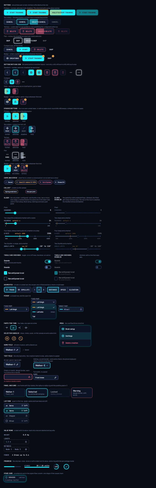

The Component Library. Colours, text styles and icons are on ColorsAndStyles; this page is only the components that use them. **Every screen uses these and nothing else**: a slider on Brain setup is the same slider as on Train setup and in a part's settings. New screens pick from here before drawing a new control.

Touch targets are 48px, even when the visible control is smaller: a button, icon button, field or segmented control is `control` (40) high, and a 24px slider track sits in a 48px row. All spacing and heights use the tokens in Spacing; nothing else. One `primary` (`accent` fill, `on-accent` text, `glow`) per surface; everything else is `panel-raised` with a `line-strong` border. Destructive is a `danger` outline plus a word, and irreversible ones are **hold to confirm** (a fill sweeps across, about 0.8 s). A disabled control is dimmed to 50% and, where it has an edge or a track, that is dashed (the same for every button, whatever its kind or layout, and for a slider's track and thumbs); it says why in a nearby line.

- **Buttons.** One component, `btn`, with four choices that combine freely. **Kind**: `primary` (accent fill, one per screen), `secondary` (the plain raised button, no class needed beyond `btn`), `tertiary` (outlined in danger red) and `flat` (no box, for a top bar or a nav icon). Only primary glows at rest; the other three pick up a glow only when selected. **Layout**: a row (icon and/or label), `icon` (a `control` 40 x 40 box centred in a 48 x 48 touch area, 4 px of margin on all four sides) or `stack` (a `touch` 48 x 48 box, the icon over a small label — or with no label at all, which is all the play button is). **Size**: standard, or `compact` (a smaller control-sm box or min-height) for a row or icon button; stack is always touch, there is no room under a label for a smaller box. **State**: `on` (selected: a 2 px border and an inward-and-outward glow, both in that kind's own colour — halo for primary, accent for secondary, danger for tertiary, ink for flat) and `off` (disabled: dimmed with a dashed border, the same for every kind and layout, so a disabled Start training and a disabled Beam tool look alike). Hold-to-activate (`c_hold`) works the same way for all four kinds and all three layouts: the fill is that kind's selected colour at 50% opacity. A **badge** (a small `halo` count in the corner) is available on any kind or layout too — always halo, never the button's own colour. The play button is a primary `stack` button with no label, the tool rail cells are `stack` buttons with one; neither is a component of its own. Copy, not the component, decides whether a tertiary action needs a verb label. The padlock (`on` when locked), pause and speed are icon buttons on the game screens.
- **Slider.** One component with a few settings. A track, a filled part in `accent`, an 18px thumb, the value in `readout-md` at the right of the label. **Thumbs**: one, or two for a range (the fill runs between them). **Steps**: two or more labels the screen supplies, always evenly spaced (a slider with two steps names only its ends); the end labels are aligned to the ends of the track. **Marker**: one 2px `halo` line across the track with a name ("default 4", "now 35°"). The slider only draws it; what the marker means, and whether the thumbs respect it, is decided by the screen. **Marker name placement**: the name lives in the label row, between the label at the left and the value at the right, centred over the marker; where that would touch the label or the value it slides towards the free space. It never sits among the steps, so they cannot collide. **Position** is given as 0.0 to 1.0 for thumbs and marker alike. **Disabled** is dimmed to 50%: the filled part stays solid, the rest of the track is dashed, and the thumbs are hollow and dashed, like a disabled button, and a nearby line says why. **Steppers are not part of the slider**: where a value is also set exactly, the screen lays out two `btn icon sm` buttons (minus and plus) either side of the track (`stepped_slider` in the kit); that is layout, not a component.
- **Toggle** for an on or off setting that applies now (Sounds); **checkbox** for an option that goes with an action (Run until power is out). Both carry the state in shape as well as colour and can show a line of help.
- **Segmented.** A small set of modes; the chosen one is filled.
- **Picker.** A row with an optional small accessory (an icon, or a caller-drawn swatch: the picker does not know which), the current choice, and a chevron. Opened, it lists the choices under it in the same frame as Menu (`c_card` kind `menu`), each row with the same kind of accessory; a choice can carry a check (selected) or a short note instead of a check ("swaps", on Parts, for a choice that needs explaining rather than being refused). **Locked** shows a lock instead of a chevron and is not editable.
- **Tray tabs, selection handles.** Tray tabs are icon tabs, one open at a time. Handles (move, rotate, scale) appear around a Select selection. The tool rail on Build is not a component: it is a screen layout that stacks `stack` buttons in a column, with the play button (a primary `stack` button with no label) at the bottom on a saved creation.
- **Text field.** The only text entry: the creation's name in a top bar (a `control` high field with a pencil) and a name in a settings panel (full width). **Editing** is an `accent` 2px border with a soft ring, a caret and a check; the phone keyboard opens and its Done ends the edit, there is no Save. **Empty or invalid** is a `danger` border, a warn icon and one line of words ("A creation needs a name"). Two sizes of the same field: in a **bar** it is `control` high with `heading` text, in a **panel** it is `control-sm` high with `body-strong`.
- **Menu.** The overflow list: 48px rows with an icon, a word, and `danger` for destructive ones.
- **Panel and card.** (The Frame surface, see ColorsAndStyles: menu, dialog, stage card and a picker's open list are the same frame.) One frame at rest (`edge` 1px, `radius-lg`, `panel`, `space-3` padding) with variants: `sel` (accent 2px and `glow`), `pick`, `lock` (dashed, dimmed), `warn` (`danger` border, always with words), `hint`, `ok`, `glow` and `raised`, and the padding sizes `snug`, `tight`, `roomy` and `flush`. Cards on Creations, Achievements and Train setup, the settings panel and dialogs are all this frame.
- **List row.** A part in the tray: a glyph, a name and how many are left, `control` high with a `radius-md` border. States: at rest, selected (`accent`), locked (dashed with a lock) and none left (dimmed).
- **Value rows.** A `caption` label with its value in `readout-md`. A read-only value (length, between which nodes) is dashed with a lock or move icon so it says why it cannot be edited. The power row is a value row with a bolt.
- **Callout.** A small `halo` card that names something on the canvas (`danger` when it explains a refusal).
- **Progress.** There are two, and every screen uses these: the **bar** (`c_prog`: a `line` track and an `accent` fill; `c_meter` is the same bar under a `caption` label with its value) and the **ring** (`c_ring`: the percentage inside, a check when done). Nothing else draws progress: not chips, not value rows, not a screen.
- **Panel header.** The title row of every side panel (Parts, a part's settings, a selection): an optional glyph, the title in `subheading` (it truncates with an ellipsis, never wraps) and icon actions on the right, each `control-sm` wide. Deleting a part is a full-width `danger` button at the end of its settings, the same as the selection panel, not an icon in the header.
- **Info row.** A ringed `halo` icon with a title and a `note`, used to explain a handle or a mode.
- **Stage card.** A numbered card of the signal-flow column: a ringed number, the stage name in `stage`, an optional right-aligned `note`.
- **Chips and status.** Small facts. Warning is `halo`, error is `danger`, and both add an icon and words.

Nothing depends on hover: every affordance works the same on a touch screen.

**For Godot.** Each control here is one scene, built once and reused: `Button` (one scene: kind default, primary, danger or flat; layout row, icon or stack; state on or off; StyleBoxFlat `raised`, with the primary and on looks as variants, and `off` as a dashed border at 50% alpha), `Slider` (HSlider with a custom grabber, configured by properties: `thumbs` as 0.0 to 1.0 (one, or two for a range, the same scene with a second grabber), `steps` as an Array of at least two labels laid out evenly, `marker` as a position 0.0 to 1.0 and a name, `enabled`; the marker name is a Label in the label row, centred over the marker and clamped between the label and the value by their measured widths; the minus and plus buttons of a stepped slider are an HBoxContainer around it), `Toggle` and `Checkbox` (CheckButton, CheckBox), `Segmented` (a row of toggle Buttons in a ButtonGroup), `Picker` (a Button that opens a PopupMenu), `Menu` (PopupPanel), `Chip` (PanelContainer with a Label), `Dialog` (a modal PanelContainer). The design tokens become one Theme resource: `space-1` to `space-5` are `separation` and `margin` constants (BoxContainer separation, MarginContainer margins), `control-xs` to `touch` are `custom_minimum_size`, radii are StyleBoxFlat corner radii, colours are theme colours per theme. Containers do the layout (HBox, VBox, Margin, Grid); no screen positions a control by hand except over the arena canvas.

**One implementation each.** Every entry above is one component in the kit and every screen calls it: `c_textfield`, `c_toggle`, `c_seg`, `c_slider(label, value, thumbs, steps, marker, enabled)` (`c_range` is the same slider with two thumbs; `stepped_slider` is only the layout with minus and plus buttons), `c_pick(label, value, accessory, open, opts, lock)`, `c_value`, `c_readonly`, `c_meter`, `c_power`, `c_row`, `c_tabs`, `c_panel_head`, `c_info_row`, `c_card` (`c_panel` is the same with its arguments swapped), `c_chip`, `c_prog`, `c_menu`, `c_btn`, `c_ib` (the icon layout of `btn`) and `c_hold` (a `danger` button with a sweeping fill). Older names (`tog`, `nm`, `ro`, `pw`, `kv`, `bar1`, `seg5`, `field`) are only aliases of these. A new screen adds a variant here, never a private copy.

**Rule: frames.** A panel, card, tile or dialog is `c_card` (class `pnl`): radius-lg, padding space-3, 1px `edge`. It has these variants, all of the same frame: `sel` (accent border and glow), `pick` (halo ring, the chosen stage), `lock` (dashed, dimmed), `warn` (danger border), `hint` (halo border), `ok`, `glow` and `raised`; menu and dialog are the frames `menu` and `dialog`. The sizes `snug`, `tight`, `roomy` and `flush` (a thumbnail that bleeds to the edge) only change the padding. A frame does not set its own radius, padding or border colour. A tool rail is a screen layout, not a frame: `.rail` stacks `btn stack` cells touch by touch, space-1 apart.

**Rule: one implementation.** Every control, frame and figure comes from the component library (`c_*` functions in the kit; in Godot, one scene each) and is marked `data-c` in the preview HTML, or is one of its classes (`btn`, `chip`, `bar`, `field`, `partrow`, `call`, `pnl`, `well`, `switch`, `scrollbar`, `rail`). A screen never draws its own copy: no hand-built frame (border, radius and background on a bare element), no inline border, radius, background or shadow on a component class, no second progress ring. A new look is a variant of the component, added once. The build lists every violation and fails on any.

**Rule: size is content.** A view never sets `width`, `height`, `left`, `top`, `right` or `bottom` in pixels. A component is as big as its content, its font size and its padding tokens (`wrap_content` in Android, `custom_minimum_size` left at zero in Godot). Where a size has to be fixed it is named once in Spacing and used by class: screen slots (`slot-rail`, `slot-arena`, `slot-side`, `slot-tray`, `slot-fill`, `slot-foot`), page columns (`pg`), value columns and card widths (`w-col-*`, `w-card`, `w-tile`, `w-well`), menu and dialog widths (`w-menu`, `w-dialog`), and the figures that have to be exact (`w-brain`, `h-screen`, `h-stage`, `h-thumb`). The arena has no width of its own: it takes what the rail and side panel leave, so a wider screen gives it more. A callout's position in a figure is data and stays. The build fails on any other fixed size in a view.

Preview: [components/ComponentLibrary/preview.html](components/ComponentLibrary/preview.html)

---

# Navigation

*Foundations · How the screens connect*

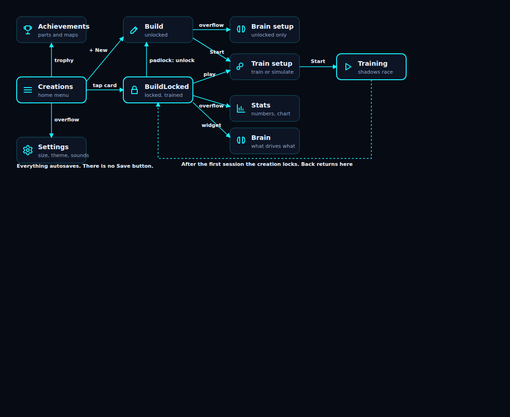

The whole app is a hub-and-spoke around **Creations**, the home menu. **Build and BuildLocked are one scene in two states**: unlocked and locked.

- **Creations → + New → Build.** Build is the unlocked state. Everything autosaves; there is no Save. Its top bar has **Start training**, and an overflow with **Brain setup**, **Power budget** and **Delete**.
- **Build → Start training → Train setup → Training.** When a training session has finished, the creation **locks**. From then on tapping its card opens it in the locked state (BuildLocked).
- **Creations → tap a trained card → BuildLocked** (locked). Its **padlock** opens the Unlock dialog; unlocking returns to Build and deletes the training, after a warning and a hold to confirm. **Copy** a creation first to keep the trained one.
- **BuildLocked → play (bottom of the rail) → Train setup → Training.** Train setup is where Train or Simulate, shadows, run length and map are chosen.
- **BuildLocked → overflow → Stats** and **Power budget.** Tapping the **brain widget** opens the **Brain** view.
- **Creations → Achievements** (the trophy). Achievements unlock new parts for Build and new maps for Train setup.
- **Creations → overflow → Settings.** UI size, theme (Neon, Paper or Use phone) and sounds; nothing to reset there. **Restore example** is in the same menu.
- **Back** returns exactly one step. Training's Back returns to the creation and leaves training saved. There is no navigation bar and no mode switch.

Every top bar has the same shape: Back, then the title (the creation's name, editable in Build and BuildLocked), spacer, and at most two icons plus overflow.

Preview: [components/Navigation/preview.html](components/Navigation/preview.html)

---

# Overlays

*Foundations · The two confirmations and the achievement toast, and where each appears*

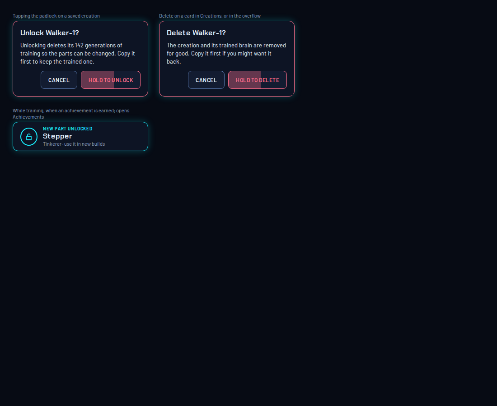

Three overlays, no more. Each is shown over a dimmed screen (or at the bottom edge for toasts) and each is listed here with the one moment it appears.

- **Unlock dialog.** Tapping the padlock on a saved creation. It names what is lost ("142 generations of training") and needs a **press-and-hold** on a `danger` button (a fill sweeps across, about 0.8 s). Unlocking resets the model. Cancel is the other button and is never `danger`.
- **Delete dialog.** Delete on a card in Creations or in the overflow. It is the same dialog as Unlock and uses the same **press-and-hold** button ("Hold to delete"), so a delete can never happen by accident and there is **no Undo**. It says the creation is removed for good and suggests Copy first.
- **Achievement toast.** While training, when an achievement is earned: a glowing `accent` card with the reward glyph, the name and the achievement that earned it. It appears once, never blocks controls, and opens Achievements when tapped.

There is no Copy dialog or toast: Copy makes an identical creation at once and the new card appears in the list. Every destructive action is a hold to confirm; there is no undo toast. Never place two destructive actions side by side. Buttons are 48px and named with verbs.

Preview: [components/Overlays/preview.html](components/Overlays/preview.html)

---

# Parts

*Foundations · Every part, and how each kind is placed*

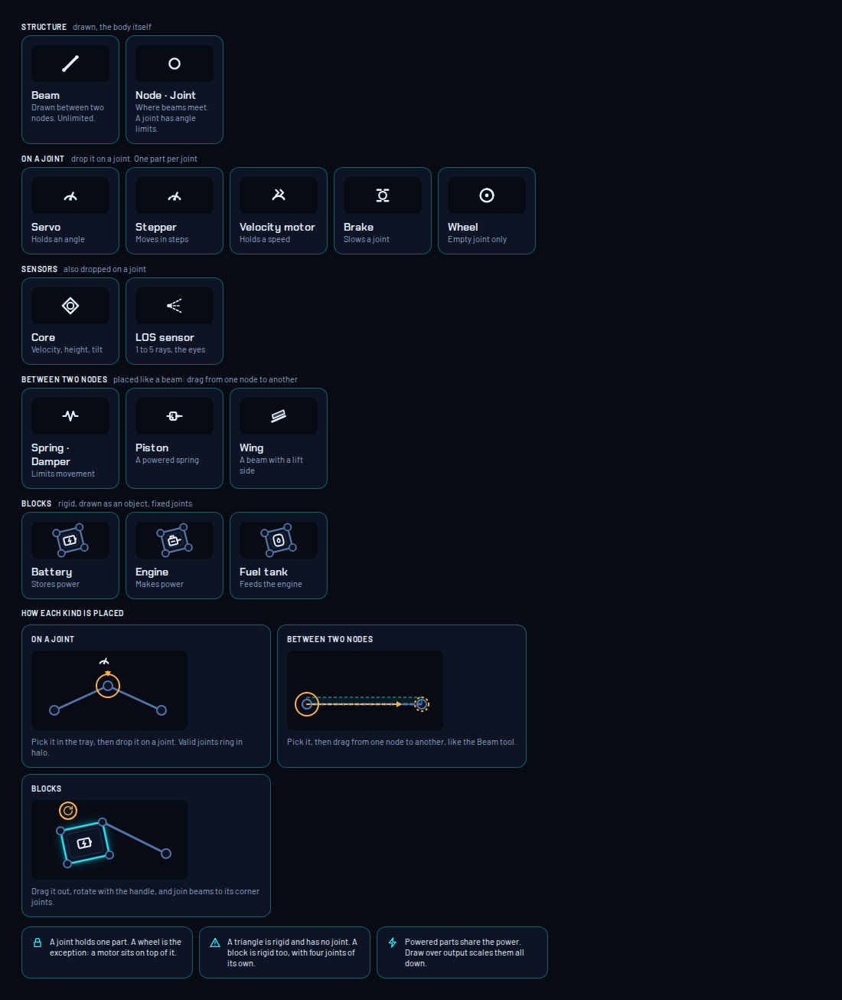

Every part of a creation, each with one glyph that never changes (20px grid, 2px stroke, round caps; `line-strong` for passive, `accent` for anything that acts or senses). The tray in Build has the same groups.

**Structure.** **Beam**: a rigid rod, drawn, unlimited. **Node**: where beams meet, made by drawing beams. Where two or more beams meet it is a **Joint**, and a joint has angle limits (see PartSettings).

**On a joint.** **Servo** (holds an angle), **Stepper** (moves in steps), **Velocity motor** (holds a speed), **Brake** (slows the joint, passive) and **Wheel** (only on an empty joint; a motor can then sit on top of it). A joint is never a motor by itself and holds one part. A wheel is a lit ring with a hub, drawn without spokes.

**Sensors.** **Core** (its own sensors: x and y velocity, elevation, tilt) and **LOS sensor** (line of sight, 1 to 5 rays). Both are dropped on a joint, and a joint holds one part, so a joint with a motor cannot also have a sensor.

**Between two nodes.** **Spring / damper**, **Piston** (a powered spring) and **Wing** (a beam with a lift side; see Wing). They are placed the same way: pick one in the tray and drag from one node to another, as with the Beam tool. A spring or damper limits movement and does not act as a beam; a wing does, and still counts for rigidity.

**Blocks.** **Battery**, **Generator** and **Fuel tank** are drawn as objects, not as beams. Each has four fixed joints at its corners; beams are attached to those joints and to nothing else, so blocks never share a joint with each other or with a beam's node. A block moves and **rotates as one piece** (select it and use the rotate handle); its joints go with it and the beams attached to them stretch, as when a node is moved. A block is as rigid as a triangulated frame and has no joint inside it.

**Placing.** The tray shows one line of help per tab. On a joint: drop it, valid joints ring in `halo`, a joint that already holds a part is refused with "One part per joint". Between two nodes: drag from the first node to the second. Block: drag out from the tray, then rotate.

The causal chain every screen serves: cores and sensors sense the world, the brain works out what to do, motors and other outputs move the body, the body moves, distance is the score.

Preview: [components/Parts/preview.html](components/Parts/preview.html)

---

# Spacing

*Foundations · Space scale, control sizes and how a bar is built from them*

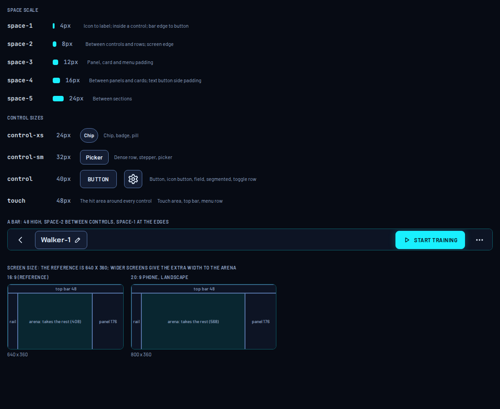

Every gap, padding and margin in every screen is one of five steps, and every control is one of four heights. **Nothing else is allowed.** Horizontal and vertical spacing use the same steps, so a row of controls has the same gap between them as between the row and the next.

**Space scale.** `space-1` 4, `space-2` 8, `space-3` 12, `space-4` 16, `space-5` 24. Use `space-1` inside a control (icon to label) and at the edge of a bar, `space-2` between controls and rows and at the screen edge, `space-3` for panel, card and menu padding, `space-4` between panels and cards, `space-5` between sections.

**Control sizes.** `control-xs` 24 (chips), `control-sm` 32 (dense rows, steppers, pickers), `control` 40 (button, icon button, field, segmented control, toggle row) and `touch` 48. A control is drawn at its size but its **touch area is always 48**, so a 40 button in a 48 bar has `space-1` above and below it.

**Top bar.** 48 high, `space-2` between its controls, `space-1` (plus the control's own touch margin) at the edges, so every icon button, button and field in it is `control` high and centred.

**Rules.** No other pixel value is used for spacing or a control height. Sizes of drawings (a beam, a node, a slider thumb) are not spacing and keep their own values. The gen script lints this: it counts any spacing value that is not a token and must report zero.

**Screen size.** The reference is 640 x 360 units. The height is always 360; the width is the device's (640 at 16:9, about 800 at 20:9). The top bar (48), the tool rail (56) and the side panel (176) keep their size, and the arena takes everything else, so a wider phone gets a wider play area and the same buttons. **UI size** scales all of it: at 200% a 16:9 screen is 320 x 180 units. When the arena would be narrower than 200 units, the side panel collapses to its 28px tab. **For Godot:** Project Settings, Display, Window, Stretch: mode `canvas_items`, aspect `expand`; keep the arena as a Control with the expand size flag and the rail and panel with a fixed `custom_minimum_size`; UI size sets `Window.content_scale_factor`; read `DisplayServer.get_display_safe_area()` for the cutout inset.

Preview: [components/Spacing/preview.html](components/Spacing/preview.html)

---

# GenerationStrip

*Components · The shadow strip: who is ahead, and who to follow*

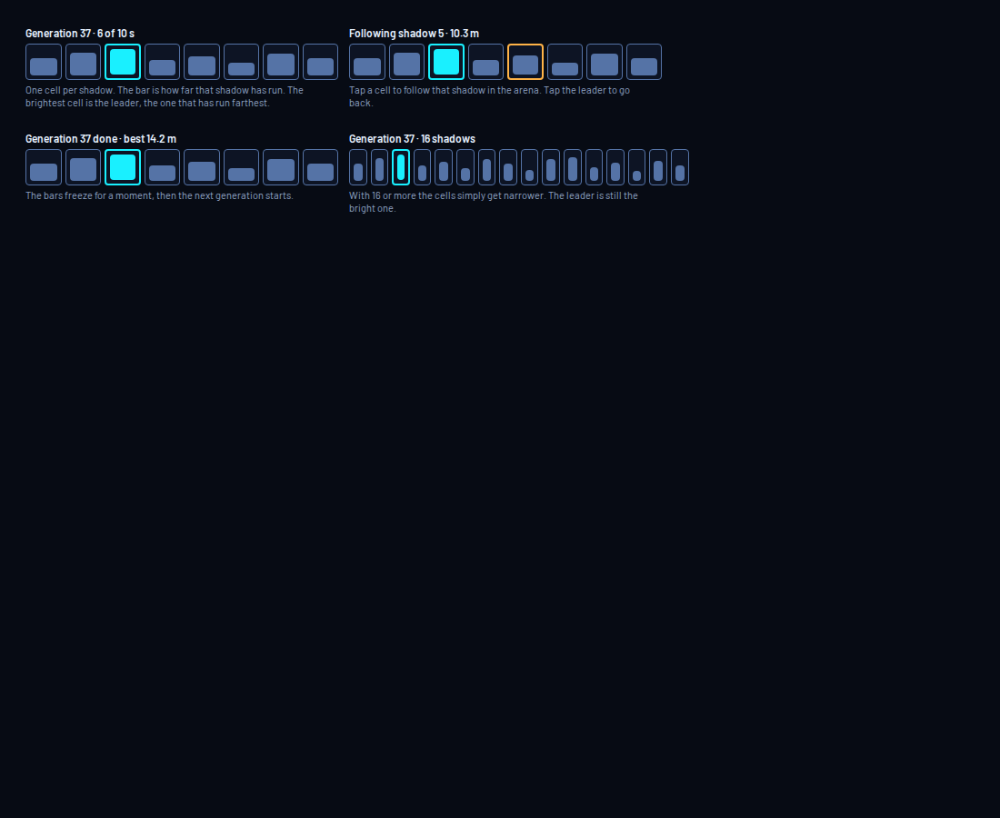

One cell per **shadow** (the ghost copies that all run at the same time). Each cell shows **how far that shadow has travelled**, as a bar that grows during the run, so a glance says who is ahead. The leader has a bright `accent` border and fill (its bar is simply the tallest, so no extra marker is needed) and is drawn in full in the arena; the others are `line-strong` and faded in the arena.

**It is tappable.** Tapping a cell makes the arena follow that shadow (drawn in full) and rings the cell in `halo`; the caption says "Following shadow 5 · 10.3 m". Tapping the leader goes back to following the leader. Following stays put if a shadow is passed by another.

There is no time bar under the strip: all shadows run for the same time, so one line of text carries it ("Generation 37 · 6 of 10 s"). When the run ends the bars freeze, the caption reads "Generation 37 done · best 14.2 m" for a moment, then the next generation starts. With 16 or more shadows the cells narrow to a few pixels.

Preview: [components/GenerationStrip/preview.html](components/GenerationStrip/preview.html)

---

# SignalFlow

*Components · Senses, Brain, Outputs, Distance: at rest, other outputs, a core tapped, a large brain*

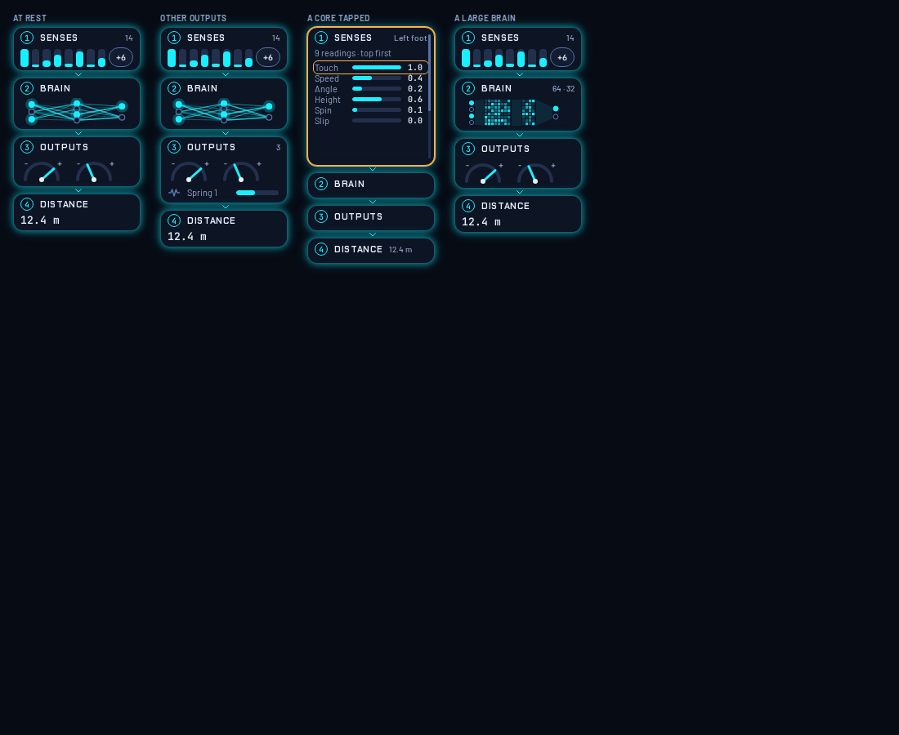

The causal chain as four stacked cards joined by `accent` arrows, in the order things happen: **1 Senses**, **2 Brain**, **3 Outputs**, **4 Distance**. The words are the parts the player just built: cores sense, the brain is the network, motors move the body, and distance is the score.

**At rest** each card is one picture and no captions: a row of small level bars (one per sense), a tiny network, half-dials (one per motor) and the distance readout.

**Senses can be many.** A creature can have many cores, and each core has several readings. At rest the card shows the eight most active as bars and a `+6` chip for the rest, and the header carries the total. **Tap a core on the body** and Senses expands to that core's readings (named rows: "Touch", "Speed", "Angle"...), most active first, in a card about 170px tall that **scrolls** (thin scroll thumb, fade at the foot). The other three cards collapse to one-line headers so the column never overflows; tap one to swap.

**Outputs, not only motors.** The card is always called Outputs, because motors are not the only output. As soon as a creation has other output parts (a spring's stiffness, for instance) the card is titled **Outputs**, keeps the dials for motors and adds one bar row per other output with its part glyph. More rows scroll in the same way.

Tapping a body part outlines the matching card in `halo`. Tapping Brain opens the Brain screen. Cards are 156px wide inside a 168px column.

**A large brain.** The Brain card must stay one glance tall whatever the network size, so it never draws neurons as circles beyond twelve per layer. Past that, each hidden layer becomes a small **grid of squares** (one per neuron, at most 10 x 10, brightness = activity), the senses and motors are a few dots at the ends, and faint bands show the layers are connected. The header carries the shape ("64 · 32" for two hidden layers) instead of a picture of every neuron. The card is still one tap to the Brain screen, where BrainScale takes over.

Preview: [components/SignalFlow/preview.html](components/SignalFlow/preview.html)

---

# Achievements

*Screens · Achievements: where new parts and maps are earned*

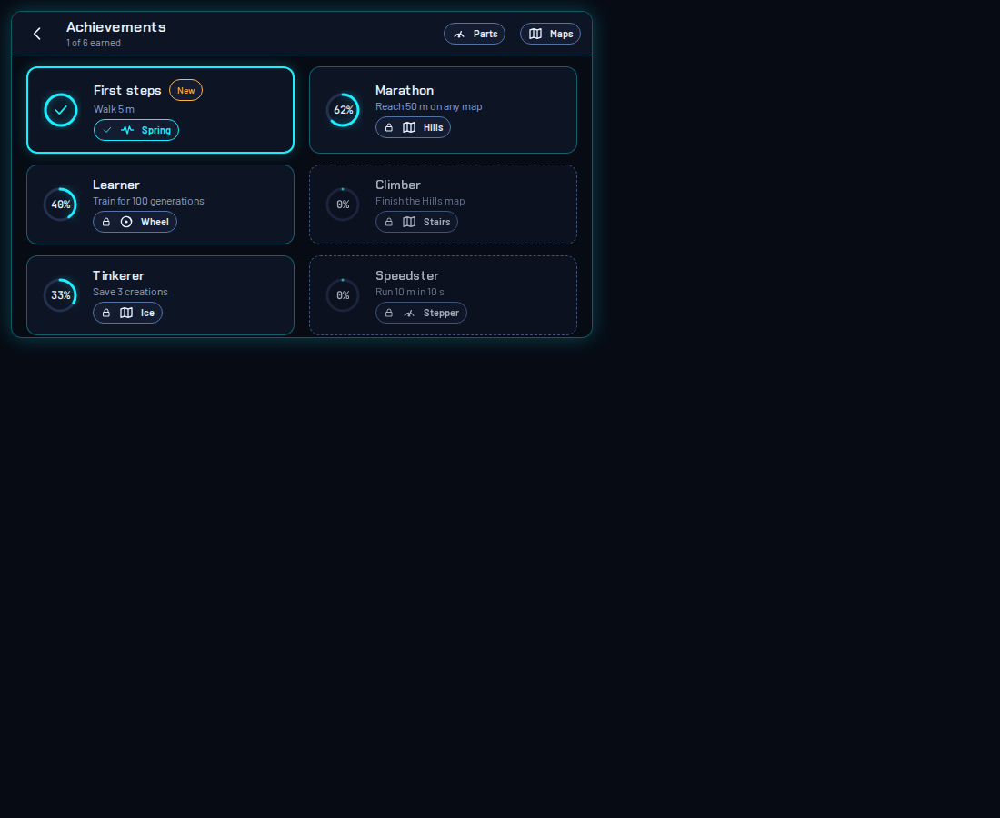

Opened from the trophy on the Creations menu, from a toast, or from a locked map or part. It is the only place parts and maps are unlocked.

Each card has a **progress ring** (a check when done), the name, a one-line goal and a **reward chip** with the glyph of the part it unlocks (the same picture as in the Parts tray) or the map glyph for a map, and the name. Chips show a lock until earned and a check afterwards. States: earned and new (`accent` border, glow, a "New" tag), in progress (ring with percent), and blocked by another achievement (dashed, dimmed; the goal names the prerequisite). Two chips in the top bar say what can be earned (Parts, Maps).

Achievements are **player-wide**: an unlocked part or map is available to every creation. The Creations trophy shows a badge with the number of new ones; opening the screen clears it. When one is earned during training a toast appears over Training (see Overlays) and the thin `accent` line under the top bar fills toward the next.

Preview: [components/Achievements/preview.html](components/Achievements/preview.html)

---

# BrainFocus

*Screens · Brain: which senses drive which outputs. Line thickness, no numbers*

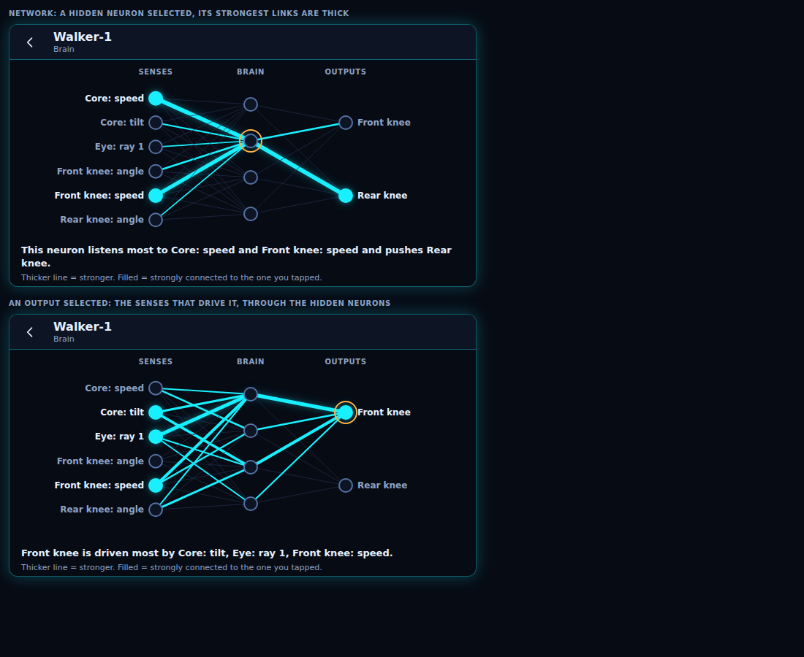

The brain view, opened by **tapping the brain widget** on BuildLocked, or the Brain card in Training. It answers one question: **which senses drive which outputs?**

**Strength is only line thickness.** A thicker, clearer line is a stronger link; weak links stay thin and faded. There are no numbers, no plus or minus and no dashed lines, because the sign does not help a beginner. One colour is used, `accent`.

**Connected neurons are filled.** Tap a hidden neuron and its links thicken, and the senses and outputs it is strongly connected to are filled; the rest stay outlined. Tap an output and you see the senses that drive it, through the hidden neurons. The tapped one keeps the `halo` ring, labels name every sense and motor in words, and one sentence under the picture says the same thing. Tap empty space to clear.

The top bar is only Back and the creation's name: there is no chip and no second view.

Preview: [components/BrainFocus/preview.html](components/BrainFocus/preview.html)

---

# BrainScale

*Screens · Brain on a large network: squares, and one strong path from senses to outputs*

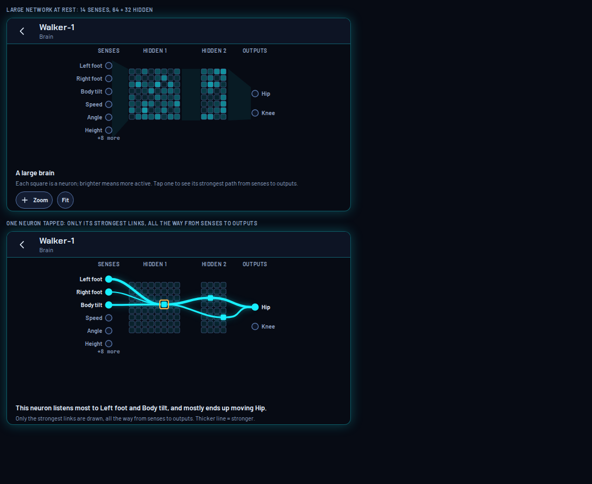

How the Brain screen stays readable when the network is big (up to 3 hidden layers of 100 neurons, and many senses). It works like BrainFocus, with the same rules: **no numbers, no signs, one colour, strength only as line thickness**, and only the strong links.

**Level of detail by layer size.** Up to 12 neurons in a layer: the node-link drawing from BrainFocus. 13 to 100: the layer becomes a **grid of squares**, one per neuron (10 x 10 at most), brighter for more active. Senses and outputs are always named and never squares; more than six senses show the six most active and "+8 more", which opens a scrolling list.

**At rest,** connections between two layers are a soft translucent band, "densely connected", without ten thousand lines.

**Tap a square** and it gets the `halo` ring. Then only the **strongest path through it** is drawn, **all the way from the senses to the outputs**: the strongest links coming in from the senses, and on through the next layers to the outputs they end at. Squares and named neurons on that path are filled; everything else fades. One sentence says it in words ("listens most to Left foot and Body tilt, and mostly ends up moving Hip"). Weak links are left out, not drawn faintly.

**Touch.** Squares are 10px, below the 48px target, so a tap selects the nearest square and shows a **loupe** until the finger lifts. Pinch to zoom, drag to pan, **Fit** resets.

Preview: [components/BrainScale/preview.html](components/BrainScale/preview.html)

---

# BrainSetup

*Screens · Brain setup: hidden layers, neurons per layer, with the shared slider*

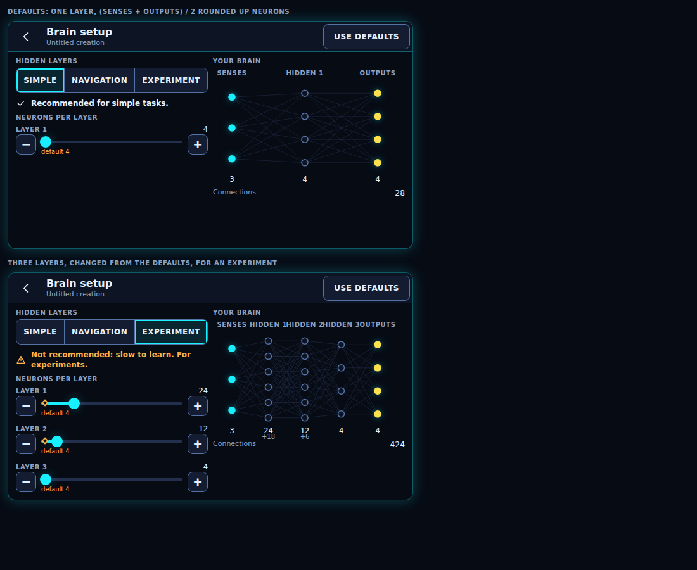

Opened from **Brain setup** in the overflow menu of an unlocked creation (it is not a chip in the top bar). The brain's shape is fixed once the creation is locked, so this is only reachable before the first training session ends.

**Hidden layers** is a segmented control: Simple (1 hidden layer), Navigation (2) and Experiment (3). The cells size to their labels and never clip. One line under it says whether the choice is recommended (a check) or not (a warn icon and the reason). **Neurons per layer** has one slider per layer, from 1 to 100, using the shared slider with steppers (see Component Library). The **default** is the slider's marker, a line across the track with its name "default 4" in the label row above it, which is (senses + outputs) / 2 rounded up; it moves when the number of senses or motors changes. **Use defaults** in the top bar resets every slider.

The picture on the right is the brain being made: senses on the left, hidden layers, outputs on the right, layers of more than six neurons drawn as six with "+N", and the connection count under it.

Preview: [components/BrainSetup/preview.html](components/BrainSetup/preview.html)

---

# Build

*Screens · Build: place parts, move and rotate blocks, autosaved, Start training*

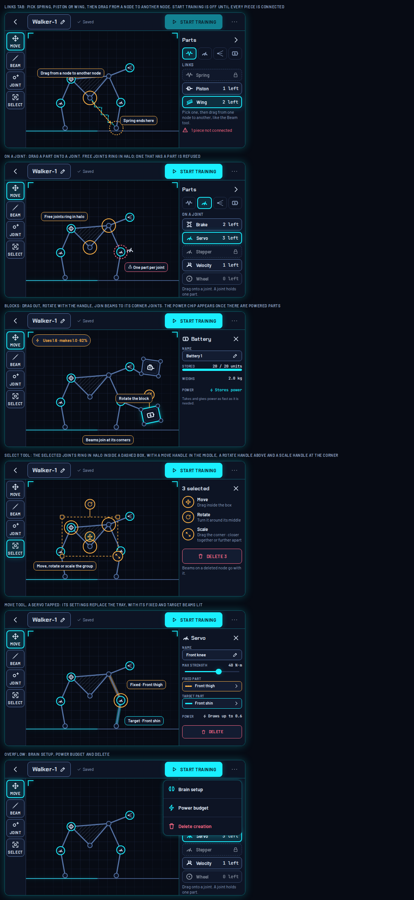

Build and BuildLocked are **one scene in two states**. In Godot there is a single `Build` scene with a `locked: bool`; there is no second scene. BuildLocked is only the name of the page here that shows the locked state. The flag changes: the rail (Beam and Joint are dashed and locked, and a large play button appears at the bottom), the top bar (Start training becomes a padlock and the overflow menu), the right panel (the Parts tray becomes how trained the creation is and its actions), and the settings (structure rows become read-only). The canvas, the rail, the brain widget and the part settings are the same nodes. Build is the **unlocked** state: parts can be added and removed and beams resized. Everything **autosaves**; there is no Save button. The name at the top is editable, with a small "Saved" cue.

**Top bar.** Back, the name, **Start training** (the one primary; dimmed with the reason in the tray if a piece is not connected) and the overflow menu: **Brain setup**, **Power budget** and **Delete creation**. Start training goes to Train setup. The creation **locks itself once a training session has finished**; from then on it opens in its locked state (see BuildLocked) and can be unlocked again at the cost of its training.

**Four tools on the 56px rail.**

- **Move** is the default. Drag a node or a block to move it; **tap one part or beam to select it** (its settings open on the right), tap empty canvas to deselect. Move never adds a joint.
- **Beam** joins two existing joints with a beam, unlimited: drag from one joint to another. It never makes a joint.
- **Joint** adds a joint: tap empty canvas, or tap a beam to split it there. A joint has angle limits and holds one part.
- **Select** picks several parts by box or by tapping. A selection rings the chosen joints in `halo` and shows a dashed box with three handles like a photo editor: **move** (in the middle, or drag inside), **rotate** (on a stem above) and **scale** (at the bottom right corner, its arrows along the diagonal that points out of the box: drag closer or further to move the group together or apart). Beams stretch as nodes move. The panel says what the handles do and holds **Delete**.

There is no Delete tool. A single part is deleted from its settings (trash in the header); several from the selection panel.

**Parts tray, four tabs**, each opening one short list with one line of help (see Parts): **Links** (Spring, Piston, Wing: pick, then drag from node to node), **On a joint** (Brake, Servo, Stepper, Velocity motor, Wheel: drag onto a joint), **Sensors** (Core, LOS sensor: drag onto a joint) and **Blocks** (Battery, Generator, Fuel tank: drag out, rotate, join beams to the corners). You start with a limited number of each ("1 left"); "0 left" is dimmed; an achievement-locked part is dashed with a lock. While a part is dragged, joints that can take it ring in `halo` and a joint that already holds a part shows a `danger` dashed ring and "One part per joint".

**Blocks are objects, not beams.** A block has four fixed corner joints that beams attach to. Blocks never share a joint. A block moves and rotates as one piece and the beams on its corners stretch as when a node is moved. Selecting a block shows its settings and a rotate handle.

**Power chip.** When the creation has powered parts a chip sits at the top left of the canvas: "Uses 1.6 · makes 1.0 · 62%", in `halo` with a bolt when draw is more than output. Tapping it opens the Power budget. It is not in the top bar.

**One right-hand panel, three states.** Nothing selected: the Parts tray. One part selected: its settings (see PartSettings). Several: the selection panel.

Preview: [components/Build/preview.html](components/Build/preview.html)

---

# BuildLocked

*Screens · BuildLocked: a trained creation, locked. Brain widget, what drives what, padlock and play*

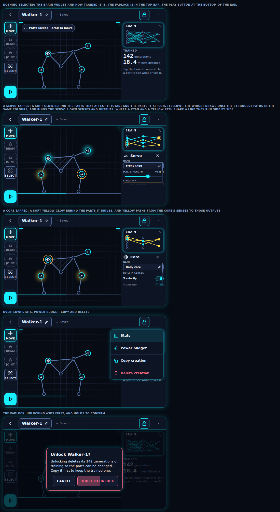

A creation **after its first finished training session**. It is the Build scene in its **locked** state (`Build` with `locked = true`, not a second scene), so the parts and the brain shape that the trained model depends on cannot change.

**Top bar.** Back, the name (editable) with the "Saved" cue, a **padlock** icon button in `accent` and the overflow menu (**Stats**, **Power budget**, **Copy creation**, **Delete creation**). Tapping the padlock opens the **Unlock dialog** (see Overlays): unlocking deletes the training, so the dialog names it ("142 generations"), suggests copying first, and needs a press-and-hold.

**Rail.** **Move**, **Beam** and **Joint** (both dashed and locked) and **Select**, and a large **play** button at the bottom, which opens Train setup. In Select the handles are Move and Rotate; Scale is off, because beams keep their length.

**One right-hand panel.** The top of the panel is always a small **brain widget** (about 154 x 96): the network drawn tiny, no numbers. **Tapping the widget opens the Brain view** (see BrainFocus). Below it: nothing selected shows how many generations and the best distance. With a part selected the panel shows that part's **settings** under the widget (they scroll).

**What drives what.** Tap a part and a **soft glow appears behind the other parts it is connected to** through the brain: cyan behind parts that affect it, yellow behind parts it affects. There are no labels or boxes on the canvas. The **brain widget** shows the same thing: it hides all lines except the **strongest paths** (the 20% rule), **cyan** from the senses that drive the part's outputs, **yellow** from the part's own senses to the outputs it affects. A neuron that belongs to the tapped part itself (a servo's angle and speed senses, its target output) gets a `halo` ring, the same ring as on the canvas. If a cyan and a yellow path share a line they are drawn **side by side**, never on top of each other. No numbers.

- **Cyan glow** (`accent`): parts that **affect** the tapped part, that is, the ones whose senses push its outputs hardest (every one within 20% of the strongest).
- **Yellow glow** (`output`): parts the tapped part **affects**, the ones its senses drive most (the top 20%).

A part can be both. A servo senses its angle and speed and outputs a target angle and strength, so tapping one glows cyan behind the parts that drive it and yellow behind the parts it drives. The tapped part itself keeps the `halo` ring, and the widget shows the same neurons with the senses on the left and outputs on the right, so the meaning does not depend on colour alone.

Nothing here adds or removes parts. To change the body, unlock it (resets the training) or copy it.

Build and BuildLocked are **one scene in two states**. In Godot there is a single `Build` scene with a `locked: bool`; there is no second scene. BuildLocked is only the name of the page here that shows the locked state. The flag changes: the rail (Beam and Joint are dashed and locked, and a large play button appears at the bottom), the top bar (Start training becomes a padlock and the overflow menu), the right panel (the Parts tray becomes how trained the creation is and its actions), and the settings (structure rows become read-only). The canvas, the rail, the brain widget and the part settings are the same nodes.

Preview: [components/BuildLocked/preview.html](components/BuildLocked/preview.html)

---

# Creations

*Screens · Creations: the home menu. Tap a card to open, Copy, Delete*

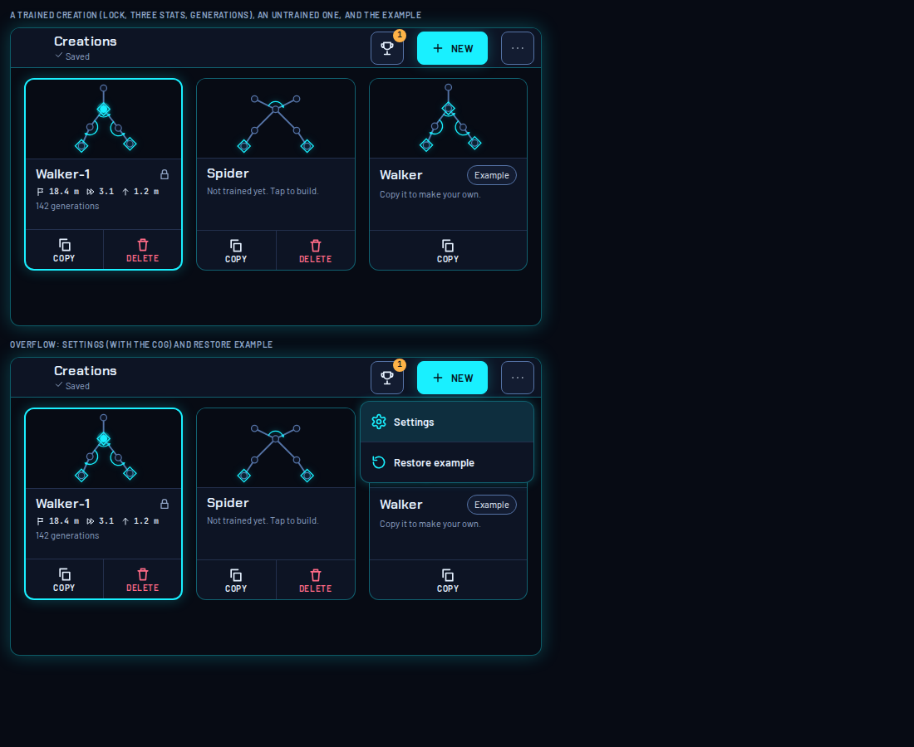

The home screen and the hub for everything: the list of saved **creations**. Three cards across, scrolling sideways.

**Tap a card to open it.** A trained creation opens in its locked state (see BuildLocked); one that has never been trained opens in Build. There is no Edit button: the padlock on the opened creation is how you unlock it.

**A card** is a live thumbnail, the name and, for a trained creation, a **padlock** and three small stats with icons: **best distance** (flag), **top speed** and **peak elevation**, then the number of generations. An untrained creation says so instead. Along its bottom edge are two 48px actions: **Copy** (an identical creation with the trained model intact; the new card simply appears in the list, no dialog) and **Delete** (a hold to confirm, no undo, see Overlays). The shipped **Example** carries a tag and only Copy; **Restore example** is in the overflow menu.

**Top bar.** The title with a "Saved" cue, the **Achievements** trophy with a badge at its top right corner for anything new, **+ New** (the only primary, which opens an empty Build) and the overflow menu: **Settings** (with a cog) and **Restore example**. Nothing has a Save button: everything autosaves.

Preview: [components/Creations/preview.html](components/Creations/preview.html)

---

# PartSettings

*Screens · The settings of every part, the fixed-part picker and angle limits*

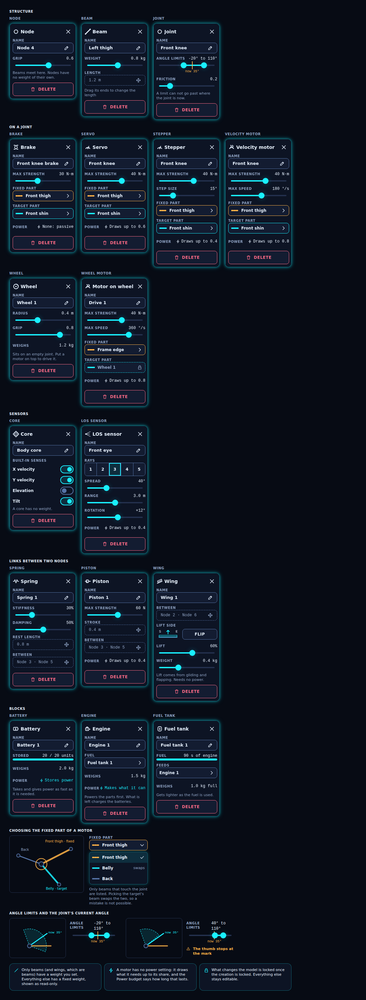

The **settings panel** for the selected part. It takes the right-hand slot that holds the Parts tray in Build and sits under the brain widget in BuildLocked. Tap a part or beam to open it; tap empty canvas or the x to close it. Every part has an editable **Name**, then its main settings, then its connections, then read-only facts. In Build the header carries **Delete** (trash); on a locked creation it is absent.

**Weight.** Only **beams** (and wings, which are beams) have a weight you set. A Core, a node, motors, sensors and blocks have no setting for it. Blocks and wheels show what they **weigh** as a read-only fact; a **fuel tank** gets lighter as the fuel is used.

**Joint.** Angle limits as a two-thumb range with a mark for **now** (the angle the joint has at this moment). The thumbs cannot cross the mark, so a limit can never be set inside the current angle. Friction is separate.

**Parts on a joint** (Brake, Servo, Stepper, Velocity motor) have **Max strength** (how hard the part can push or hold), and pickers for **Fixed part** and **Target part**. A brake needs no power and has no speed; it is passive strength only. **Stepper** adds Step size; **Velocity motor** adds Max speed. The part guesses fixed and target when placed. The picker lists **only the beams that touch the joint**; picking the beam the other role has **swaps** the two, so it cannot be invalid. Fixed is in `halo` with a dashed swatch, target in `accent`, both lit on the canvas. **Wheel**: radius and grip, and read-only weight; a **motor on the wheel** has its target locked to the wheel.

**LOS sensor.** Rays as five cells, spread, range and rotation. Its rays are drawn while it is selected. **Core.** Toggles for its built-in senses; each on is one more input to the brain.

**Links.** **Spring / damper**: stiffness, damping, rest length, the two nodes. **Piston**: max strength, stroke, the two nodes. **Wing**: the two nodes, Flip, lift, weight.

**Blocks.** **Battery**: shows what is **stored**, of what it can hold ("20 / 20 units"); it takes and gives power without a speed limit. **Generator**: which fuel tank feeds it, and nothing else to set: it makes as much as it can, feeds the powered parts first and charges the batteries with the rest. **Fuel tank**: the fuel it holds, in seconds of generator time, and which generator it feeds.

Powered parts show a **Power** row: "Draws up to 0.6", because a part uses less when it is idle. Structure that changes the model (length, stroke, what a link is between) is a dashed locked row on a locked creation.

Preview: [components/PartSettings/preview.html](components/PartSettings/preview.html)

---

# Power

*Screens · Power budget, and the power chip in Build and while training*

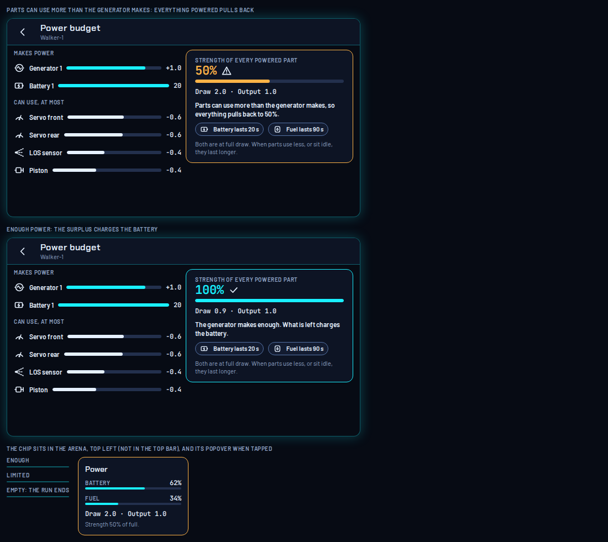

Powered parts need power. The design says so where it matters: a chip on the canvas, a screen to understand it, and the same chip while training.

**The rule.** Servos, steppers, velocity motors, LOS sensors and pistons draw power up to a maximum that follows their strength; they draw less when idle. A **Generator** burns fuel from its tank and makes electricity, as much as it can and shares it between the parts, then charges the batteries with what is left. It has no output setting. A **Battery** stores a limited amount and gives and takes power without a speed limit, so it covers peaks. A **Fuel tank** is used up by the generator. If what the parts want is more than what is available, every powered part gets the same fraction of its force: 2 wanted and 1 made means 50%. Brakes, springs and dampers are passive. When the battery and the fuel are both gone, the run ends.

**How long it lasts.** The right-hand summary says "Battery lasts 20 s" and "Fuel lasts 90 s", and says both are **at full draw**: the real time is longer when parts use less or sit idle, because they only draw what they actually use.

**Power budget.** Opened from the overflow menu of Build and BuildLocked, or by tapping the chip. The left column lists what makes power and what each part can use at most. The right card is one number, the **strength every powered part gets**, with a bar and a plain sentence. Enough is `accent` with a check; too little is `halo` with a warn icon.

**Power chip.** A chip in the top left of the canvas, only when the creation has powered parts. In Build it reads "Uses 1.6 · makes 1.0 · 62%"; while training it shows the battery percentage and a small bar. **Limited** adds a warn icon and "50% strength" in `halo`; **Empty** is `danger` with "Out of power", and that shadow's run ends. Tapping it opens a popover with battery, fuel, draw, output and the resulting strength.

**Not designed yet:** charging and refuelling between runs, and how several generators share one fuel tank.

Preview: [components/Power/preview.html](components/Power/preview.html)

---

# Settings

*Screens · Settings: UI size, theme (Neon, Paper, Use phone) and sounds*

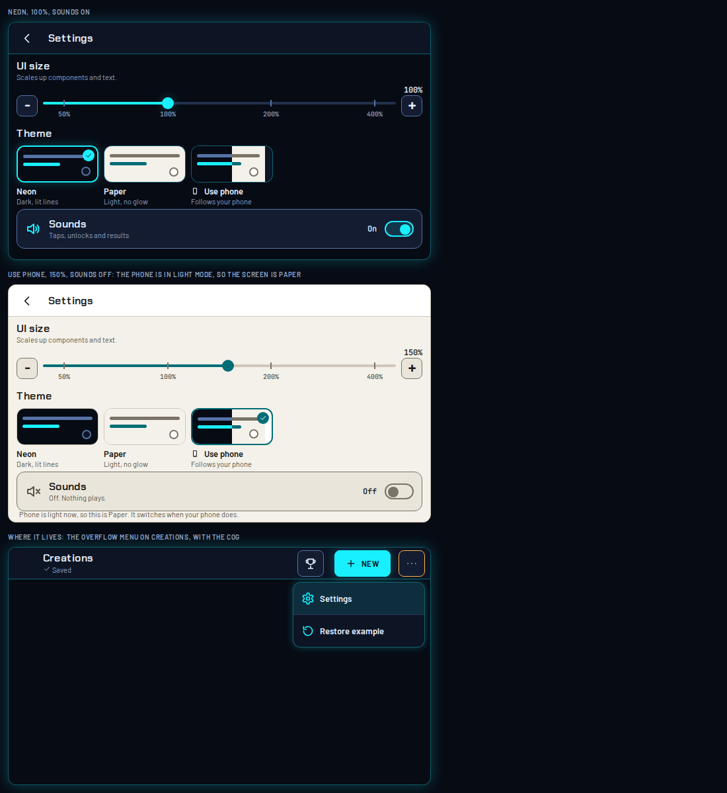

**Settings** holds the three things a player may want to change for their own phone. It opens from the **overflow menu on Creations** (Settings, then Restore example), with a cog icon, so the top bars keep their two-icons-plus-overflow shape and nothing on Build or Training carries a gear. Back returns to Creations. The bar has no overflow: there is nothing to reset, since each setting is one tap from any other value.

**UI size.** The shared slider (see Component Library) from **50% to 400%** with the value in `readout` (default 100%). It has four steps, 50%, 100%, 200% and 400%, evenly spaced, and the screen places the thumb on a logarithmic scale between them, so the everyday range from 50 to 200% is not squeezed into the left corner. A 48px **minus** and **plus** button on either side step it by 5% for precision. It scales up components and text; the arena is not scaled, it just gets what is left, so it shrinks as the panels grow. Under 100% text and spacing shrink but controls keep their 48px touch target. The screen is the preview: the change is seen on the Settings screen as it happens. Above about 200% the side panels no longer fit beside the arena, so they open over it one at a time; that layout is not drawn yet.

**Theme.** Three tiles, each a tiny picture of what it looks like: **Neon** (dark, lit lines; the default), **Paper** (light, no glow) and **Use phone**, which follows the phone's light or dark setting: Neon when the phone is dark, Paper when it is light. The tile for Use phone is split half and half so it is not read as a fourth theme, and a line under the preview says which one the phone is giving right now. The chosen tile has a check and a thicker `accent` border, so it reads without colour.

**Sounds.** One switch, on or off: taps, unlocks and results. The row shows a speaker glyph, or a crossed-out speaker when off, and says "On" or "Off" in words. A separate music level is not designed.

Every change applies at once and is saved; there is no Save button. The screen itself is drawn in the theme and size being chosen, so the change is seen where it happens.

Preview: [components/Settings/preview.html](components/Settings/preview.html)

---

# Splash

*Screens · Splash: the cover artwork on a screen while the app loads*

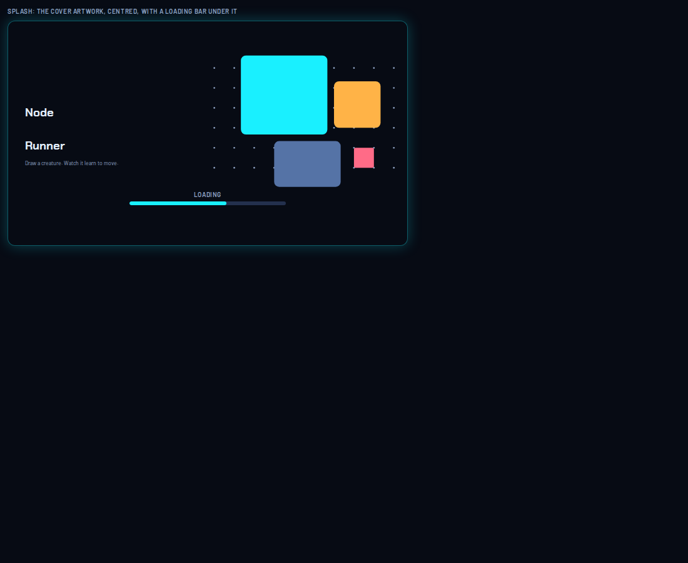

The first screen, shown while the app loads. It is the Cover artwork, unchanged and centred on a screen frame, with a **Loading** label and a progress bar under it. There is no second drawing of the logo: the Cover and the Splash are one piece of art in two places.

- **Art.** The same SVG as Cover (`bg`, `muted`, `accent`, `halo`, `line-strong` and `danger` tokens, the display and body families). The blocks bleed above and below it, so the art is not clipped to its own box.
- **Loading bar.** The one progress bar of the kit (`c_prog`), `w-well` wide, filled with `accent`. It shows real progress; when the load time is not known, hold it at the last value rather than looping.
- **Behaviour.** Shows on launch, then goes straight to Creations. It is not tappable and has no Back.

**Godot.** A scene `Splash` holds the scene `CoverArt` (the art, one scene shared with the store cover) and the `ProgressBar` used everywhere else. Do not redraw the art in the splash.

Preview: [components/Splash/preview.html](components/Splash/preview.html)

---

# Stats

*Screens · Stats: distance, speed and elevation, over generations*

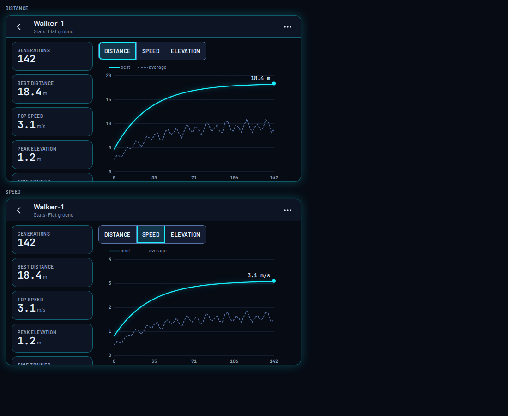

Opened from **Stats** in the BuildLocked overflow menu. Numbers on the left, one chart on the right.

**Numbers.** Generations, best distance, top speed, peak elevation and time trained. They are the best ever reached on this map, from any generation.

**Chart.** A segmented control switches the metric between **Distance**, **Speed** and **Elevation**; the chart plots the best of each generation (solid, `accent`) and the average (dashed, `line-strong`) over generations, with the latest best labelled at the end. The line style tells best from average as well as colour.

Preview: [components/Stats/preview.html](components/Stats/preview.html)

---

# TrainSetup

*Screens · Train setup: Train or Simulate, shadows, run length, map*

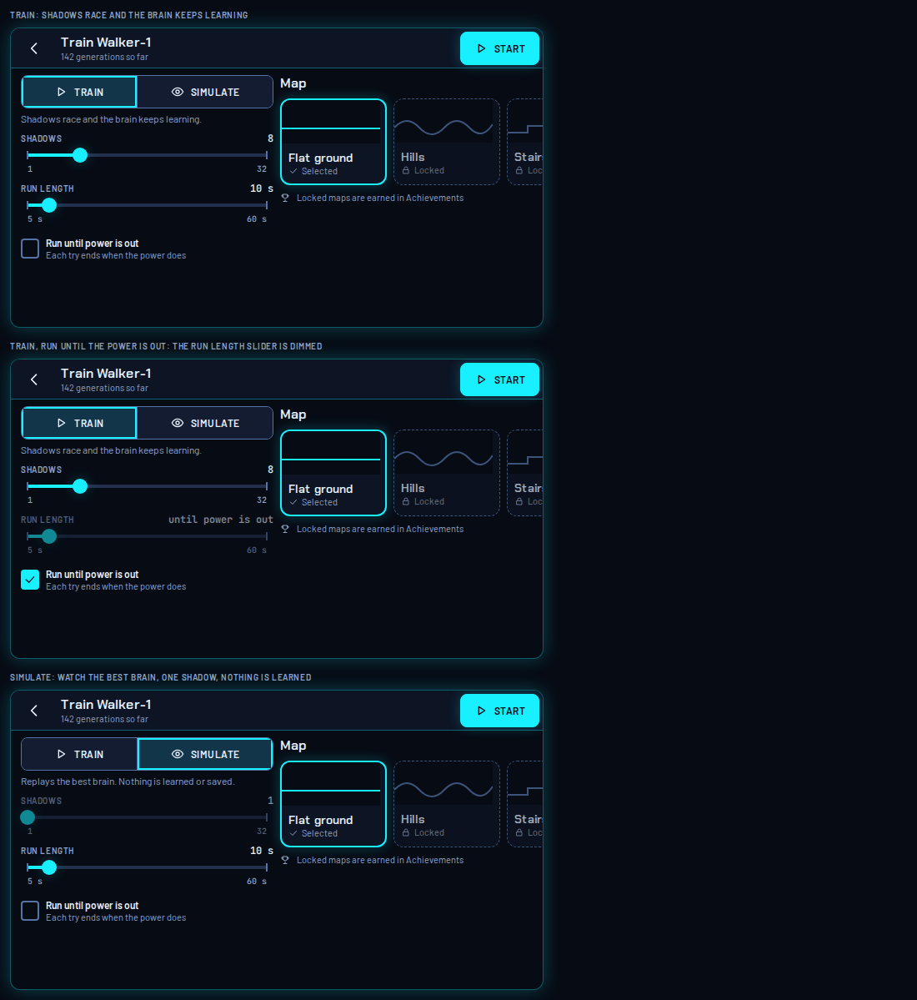

Reached from the **play** button on a saved creation. One screen, one **Start** in the top bar.

**Train or Simulate** is the first control, and each has one line under it. **Train**: several **shadows** (ghost copies, each trying a slightly different brain) race at once, the best brains are kept and the next generation starts from them, so the creation learns. **Simulate**: replays the current best brain on its own, with one shadow; nothing is learned and nothing is saved, so it is safe for showing a creation to someone. In Simulate the Shadows slider is dimmed at 1.

**Shadows** (1 to 32) and **Run length** (5 to 60 s) are the shared slider with two steps, the ends, named (1 and 32, 5 s and 60 s). **Run until power is out** is a checkbox under Run length: when it is checked the run-length slider is disabled and reads "until power is out", and each try ends when the power does. It needs a battery or a generator; without one the checkbox is dimmed and says "Needs a battery or generator".

**Map** is a row of cards; only Flat ground is unlocked at first, the others are dashed with a lock and are earned in Achievements.

Preview: [components/TrainSetup/preview.html](components/TrainSetup/preview.html)

---

# Training

*Screens · Training: shadows run at once; a tapped core expands Senses*

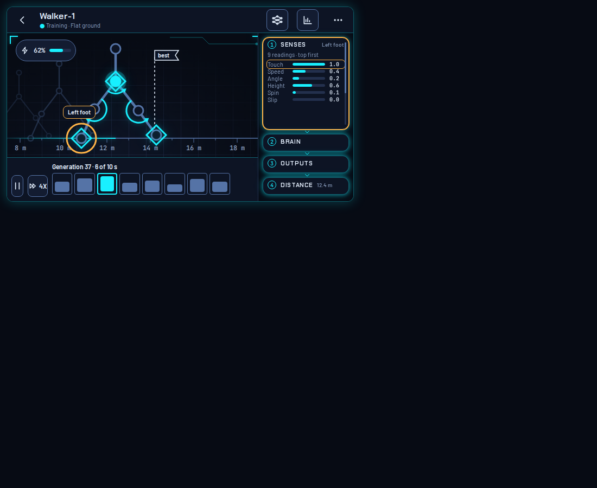

Named **Training** in the app (it also runs a saved brain in Simulate mode).

Training or simulating a creation on its map. It shows four things at rest and reveals detail only on tap.

**Arena (left).** The lead shadow in full, the other **shadows** faded behind it (they are the same creation trying different brains at the same time), a ruler labelled every 2 m and a dashed **best** marker. The camera follows the leader. Tapping a part of the leader rings it in `halo` with its name ("Left foot").

**Bottom row.** Pause, speed, and the **shadow strip** (see GenerationStrip): one cell per shadow, its bar the distance so far, the leader in `accent`. Tap a cell to follow that shadow. One line of text carries the time: "Generation 37 · 6 of 10 s". There is no time bar.

**Signal flow (right).** 1 Senses, 2 Brain, 3 Outputs, 4 Distance for the leader (see SignalFlow). Tap a core on the body and Senses expands to that core's readings and scrolls; the other cards collapse. Tapping Brain opens the brain.

**Power chip.** When the creation has powered parts, a bolt chip with the battery percentage sits at the top left of the arena (see Power).

**Top bar.** Back (to the creation), the creation name (not editable here), status "Training · Flat ground", and two icon buttons: Brain and Stats. A 3px `accent` line along the bar's bottom is progress to the next achievement. Pause is on the bottom row; stopping is Back. Just watching a saved brain (no learning) shows the same screen with "Simulating" as status and no generation caption.

Nothing here adds or removes parts; the creation is locked.

Preview: [components/Training/preview.html](components/Training/preview.html)

---

# Wing

*Screens · A beam with a lift side: gliding, flapping, flip and placement*

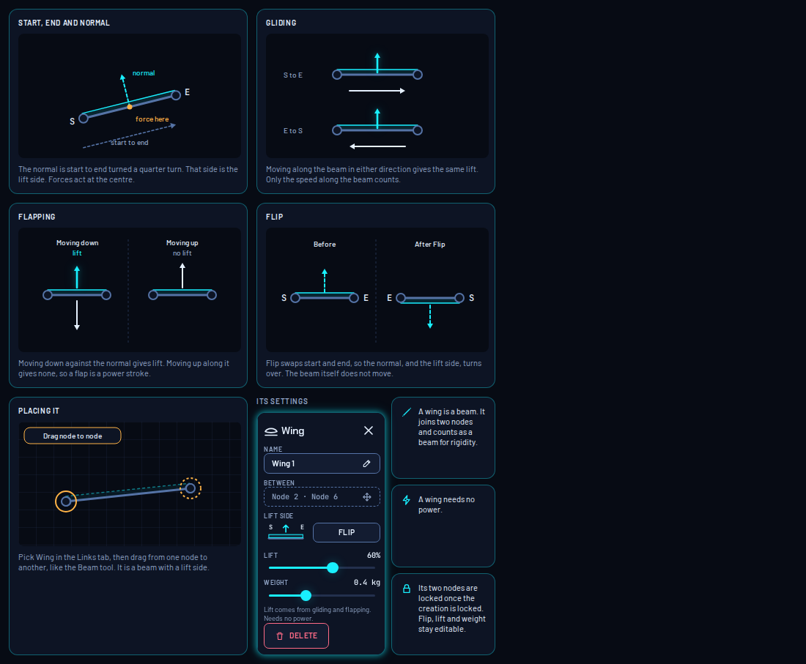

A **wing** is a beam that gives lift on one side. It is placed like a Spring or a Piston: pick it in the **Links** tab of the Parts tray (limited in number, "2 left"), then drag from one node to another, as with the Beam tool. It is not converted from a beam you already drew; it is its own beam between two nodes, so it still counts as a beam for rigidity and triangles and, unlike a spring, it has a weight.

**Definitions.** The node on the left is **start**, the one on the right is **end**. Start to end is the beam's direction, and the **normal** is that direction turned a quarter turn: for a beam that runs left to right the normal points up. The normal is the lift direction and is drawn as a dashed `accent` arrow with a lit plate on that side, so the lift side reads in grayscale too. S and E are labelled on the joints.

**Two sources of lift**, both applied at the centre of the wing (a `halo` dot marks it):

- **Gliding.** Lift whenever the speed along the beam is not zero. The sign does not matter, so moving end to start lifts the same way as start to end.
- **Flapping.** Lift when the velocity along the normal is negative, that is when the wing moves down against its lift side. Moving up gives none.

**Settings** (see PartSettings): Name, the two nodes it is between (locked once the creation is locked), **Flip** (swaps start and end and so turns the normal over), Lift strength and Weight. A wing needs no power.

**Placement.** While dragging, the start node is ringed in `halo` and a dashed ring follows to the node it would end on. Two nodes hold one wing between them.

Preview: [components/Wing/preview.html](components/Wing/preview.html)

---

# Themes

*Themes · Same screen, paper theme and low-effects neon*

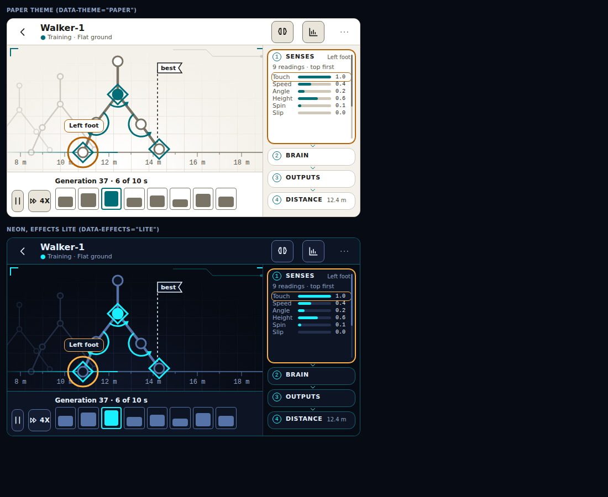

Two proofs that the neon skin is a reference, not a commitment.

**Paper** is a second colour theme (`data-theme="paper"`): warm off-white ground, white panels, teal `accent` (#006d77), amber `halo` and brick `danger`, all at 4.5:1 for text and 3:1 for marks on every ground, and the `glow` shadow and `accent-glow` set to none. **Effects lite** (`data-effects="lite"` on any ancestor, defined in bundle.css) keeps the neon colours but turns `glow` and `accent-glow` off, for low-end devices and reduced-motion. Firing neurons, the active tool and the current strip cell keep their fills and borders, so no state is lost when glow disappears.

Implementation: components read colours, fonts, radii and strokes only from tokens (in Godot, from one Theme resource per theme); swapping a theme swaps values, never layout. Icons are stroked glyphs using `currentColor`, so they follow the theme.

Every preview in this system pins its own theme on a wrapper element (`data-theme="dark"` for the neon screens, `data-theme="paper"` for the paper frame), so the viewer's light or dark mode never changes what a card shows. In the app, set the theme once on the root node.

Preview: [components/Themes/preview.html](components/Themes/preview.html)

---

# Cover

*Other · *

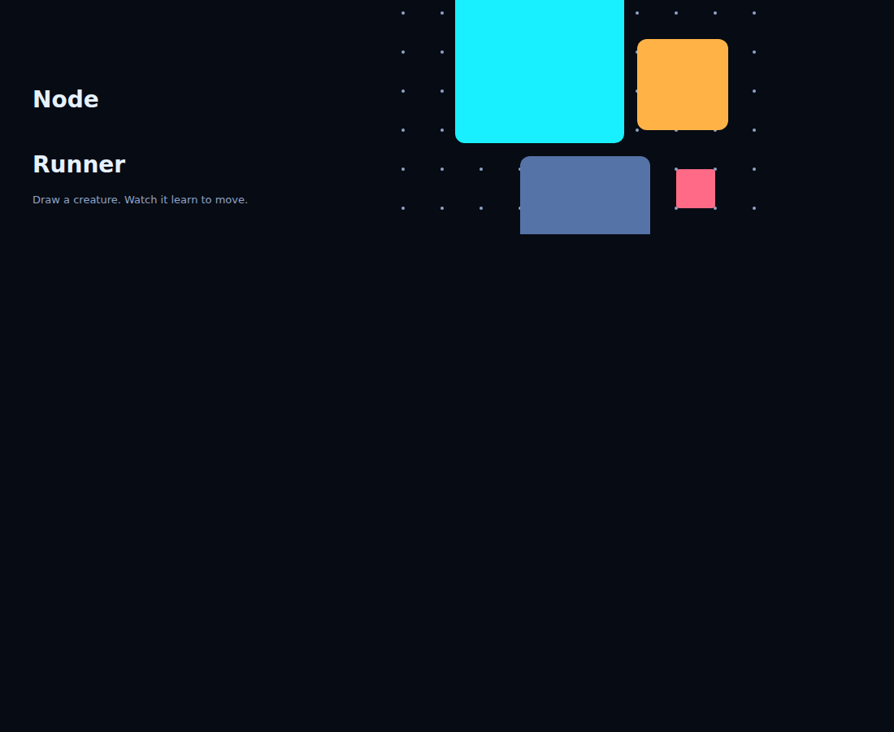

The cover of the design system: the name "Node Runner" and the line "Draw a creature. Watch it learn to move." over a 48 px dot grid, which stands for the node lattice, with four blocks in the theme colours (accent, halo, line-strong and a small danger square).

It is the game's brand art. The store cover and the Splash screen both use it. It uses only tokens (`bg`, `muted`, `accent`, `halo`, `line-strong`, `danger`, `ink`, the display and body families and `radius-lg` / `radius-sm`), so it follows a theme swap.

The same art is the **Splash** screen (see Splash): one scene `CoverArt` in Godot, used by the store cover and by the splash, so the two can never drift apart.

Preview: [components/Cover/preview.html](components/Cover/preview.html)
