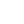

# Icons

All icons are pure white (`#ffffff`) on purpose: import them as SVG and tint them in Godot with `modulate` / `self_modulate`, or with the Button icon colour properties. Never bake a colour into the file.

Two sets. **UI icons** are stroked glyphs on a 24 grid (stroke 2, round caps and joins, `currentColor`), used at 12, 16, 20 and 24. **Part glyphs** are 20-grid pictures of parts, drawn with the dark theme colours. One SVG per icon in `icons/ui/` and `icons/parts/`.

## UI icons (39)

| Icon | Name |
|---|---|
|  | `back` |
|  | `beam` |
|  | `bolt` |
|  | `build` |
|  | `chart` |
|  | `check` |
|  | `chev-d` |
|  | `chev-r` |
|  | `copy` |
|  | `core` |
|  | `edit` |
|  | `flag` |
|  | `gear` |
|  | `height` |
|  | `joint` |
|  | `lock` |
|  | `map` |
|  | `menu` |
|  | `model` |
|  | `more` |
|  | `move` |
|  | `mute` |
|  | `pause` |
|  | `phone` |
|  | `play` |
|  | `plus` |
|  | `restart` |
|  | `rotate` |
|  | `scale` |
|  | `select` |
|  | `shadow` |
|  | `sound` |
|  | `speed` |
|  | `stop` |
|  | `trash` |
|  | `trophy` |
|  | `unlock` |
|  | `warn` |
|  | `x` |

## Part glyphs (15)

| Glyph | Name |
|---|---|
|  | `battery` |
|  | `beam` |
|  | `brake` |
|  | `core` |
|  | `fuel` |
|  | `generator` |
|  | `los` |
|  | `node` |
|  | `piston` |
|  | `servo` |
|  | `spring` |
|  | `stepper` |
|  | `velocity` |
|  | `wheel` |
|  | `wing` |
