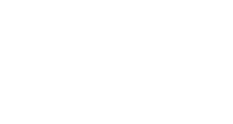

# Icons

All icons are pure white (`#ffffff`) on purpose: import them as SVG and tint them in Godot with `modulate` / `self_modulate`, or with the Button icon colour properties. Never bake a colour into the file.

Three kinds, in one folder, `icons/`, each file named `<kind>_<name>.svg` in snake_case as the app names them. **UI icons** (`icon_`) are stroked glyphs on a 24 grid (stroke 2, round caps and joins, `currentColor`), used at 12, 16, 20 and 24. Every file is the plain 24 grid with the drawing 16 on its longer side, centred, so every icon has the same air round it; nothing is scaled to fit. **Marks** (`mark_`) are the launcher glyph used as an icon, drawn 20 on the same grid at the same stroke, because a network drawn 16 fills into lumps: only `mark_brain` today, the Brain button on Training and the default dialog and notification icon. **Part glyphs** (`part_`) are 20-grid pictures of parts.

## UI icons (53)

| Icon | File |
|---|---|
|  | `icon_beam.svg` |
|  | `icon_bolt.svg` |
|  | `icon_build.svg` |
|  | `icon_chart.svg` |
|  | `icon_check.svg` |
|  | `icon_chev_d.svg` |
|  | `icon_chev_l.svg` |
|  | `icon_chev_r.svg` |
|  | `icon_chev_u.svg` |
|  | `icon_copy.svg` |
|  | `icon_core.svg` |
|  | `icon_distance.svg` |
|  | `icon_edit.svg` |
|  | `icon_elevation.svg` |
|  | `icon_eye.svg` |
|  | `icon_flag.svg` |
|  | `icon_gear.svg` |
|  | `icon_height.svg` |
|  | `icon_joint.svg` |
|  | `icon_lock.svg` |
|  | `icon_map.svg` |
|  | `icon_map_flat.svg` |
|  | `icon_map_hills.svg` |
|  | `icon_map_stairs.svg` |
|  | `icon_menu.svg` |
|  | `icon_model.svg` |
|  | `icon_more.svg` |
|  | `icon_move.svg` |
|  | `icon_mute.svg` |
|  | `icon_parts.svg` |
|  | `icon_paste.svg` |
|  | `icon_pause.svg` |
|  | `icon_phone.svg` |
|  | `icon_play.svg` |
|  | `icon_plus.svg` |
|  | `icon_redo.svg` |
|  | `icon_restart.svg` |
|  | `icon_rotate.svg` |
|  | `icon_scale.svg` |
|  | `icon_select.svg` |
|  | `icon_shadow.svg` |
|  | `icon_share.svg` |
|  | `icon_sort.svg` |
|  | `icon_sound.svg` |
|  | `icon_speed.svg` |
|  | `icon_stop.svg` |
|  | `icon_top_speed.svg` |
|  | `icon_trash.svg` |
|  | `icon_trophy.svg` |
|  | `icon_undo.svg` |
|  | `icon_unlock.svg` |
|  | `icon_warn.svg` |
|  | `icon_x.svg` |

## Marks (1)

| Mark | File |
|---|---|
|  | `mark_brain.svg` |

## Part glyphs (18)

| Glyph | File |
|---|---|
|  | `part_accelerometer.svg` |
|  | `part_battery.svg` |
|  | `part_beam.svg` |
|  | `part_brake.svg` |
|  | `part_core.svg` |
|  | `part_fuel.svg` |
|  | `part_generator.svg` |
|  | `part_los.svg` |
|  | `part_node.svg` |
|  | `part_piston.svg` |
|  | `part_pulse.svg` |
|  | `part_servo.svg` |
|  | `part_spring.svg` |
|  | `part_stepper.svg` |
|  | `part_touch.svg` |
|  | `part_velocity.svg` |
|  | `part_wheel.svg` |
|  | `part_wing.svg` |

## Energy blocks (3)

Battery, Generator and Fuel tank are drawn objects of one size each, with two **eyes** that beams attach to (see Parts in the design system). Each is exported in white layers, sized for the canvas and made at 4x so a texture stays sharp: `<block>-fill.svg` (tint with `bg`), `<block>-lines.svg` (every line and both eyes; tint with `accent`) and one live layer: `battery-cell.svg` (a lit cell, one per charged cell), `fuel-level.svg` (the level line, moved down as fuel is used) and `generator-run.svg` (the stripes, pulsed while it runs). `blocks.json` gives each block's size, its centre (the middle between the eyes), the eye positions and the live layer's positions, in canvas px. Draw blocks behind beams and joints; between blocks the lower one is drawn on top, an order set when a block is dropped, never recomputed while the creation moves.

| Block | Fill | Lines |
|---|---|---|
| `generator` |  |  |
| `battery` |  |  |
| `fuel` |  |  |
